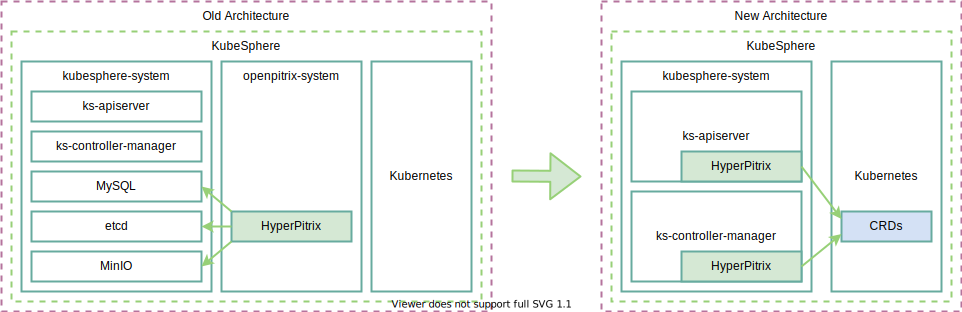

# Refactor OpenPitrix in KubeSphere 3.0

## Overview

The architecture of OpenPitrix is based on microservices, which stores application-related data in MySQL, metadata in etcd, packages and screenshots in minio, which brings in a lot of external dependencies when we integrate it into KubeSphere.

In order to make the architecture of KubeSphere more simple and lightweight, we are considering some refactoring of OpenPitrix to make it more cloud-native. Here are some of the details related to the changes.

## Architecture Changes



As you can see from the [diagram](https://viewer.diagrams.net/?highlight=0000ff&edit=_blank&layers=1&nav=1&title=op3.0#R7Zxdd6I4GMc%2FjZf2COFFLqv2Zc%2Fu7Mxud89Mr%2BYwEiXbQJgQq%2B6n3wABIcTVWlHb5qaSJy8kT36BmP9Te2Acre6on4SfSABxzxwEqx6Y9EzTAC7gH5llXVg80ygMc4oCUWhjeED%2FQmEcCOsCBTBtFGSEYIaSpnFK4hhOWcPmU0qWzWIzgpt3Tfw5bBkepj5uW7%2BigIXCajjeJuMeonkobj003SIj8svCYiRp6AdkWTOBmx4YU0JYcRWtxhBnziv9UtS73ZJbdYzCmO1T4Z87F7GnpbHoP80s%2FPjzh3dv90Urzz5eiAH3TAfz9kZJ5lTsp4X%2FnJ8LkluNzXU2JrYWjiqNkU%2FnKO6Ba547SFb8b1FyRmLWTxmFbBoWuTGhkY%2BlAvn8Z7mGU6uMUQz7ofDytrozP0J4XeTz%2FvhRkmcCYPHPFM4J5BkL1MqqD8iZZ5%2BfOSPm4JpOQ8Q4UwsKS6dw7yZlKTGrlQdMShZxADNvZ91aZpUfEn%2Ba5S754uC2kEWYp4ysQ4ySpwopDsMo8NMwr51lZyO6FQOa3EP8DBma%2BjzjGdLsCl9jNOdunjCSVK2NCSY07wsY2S7wJlUv65SUU84bgquaSVBzB0kEGV3zIiLXEgCvm8nlZjlYnrCFtZUAyiXsiyU4r1reUMovBKhqaO1He8HX1BL%2F9XXkOd%2F%2F%2Fj6PxxpaFbS%2FLn5w3EL4BmH13MnAdatetshU8LsVVrsJq6uA1VXAWhU8OqymhlUNK40h42%2F2E8C6N58RCoLsnm1EHfd65N0eB1HLaDJqDNqQVrYGpKArSIGGtA3pE4c0zZ%2Bo%2FXSdMhhdFKtbnqXHBNXZg1PVm787Ti3NaZtTksA4QYyi1QfldC9QrZOCamtQ26DerxNIv%2BSkXhSie7z2Zwjjmn1i3wwn1pHodZv0VlvYOr2mgt7O4HU0vIrdQNr3E5RCyif7rdF7BEolSA2ggFT1xaozSF0NqRLSKW%2BREowh7Ud%2B7M81rTUyz0brUNPapvXT%2BuGP3zSdldZxNjo9TWebTt7HQMOp3I2eFM5ydWg6G89OFP%2FyWeNpemfHU6VGSVMA4%2BA606J5KscVTXM3%2BZSV5pjEsDkTW%2F3OHUXX30SpPPGYze2VXSYnKzHXRWpdplaIfatdP9auN1WyRFmjDUPe51uUeahWYruUA4OWut4SIlOyoFP4Px4WZyn81nPIdu2x2uDUyLAVYJQ2CrHP0HOzuypaxB2%2BEMQHstGdpDMoy5GAK4YpatVleqkhR1IHLFlGLfzQaiiHtxr2K3hWCVZvhuei1nsh2jsn0UDS%2Fc1DiQYS0SawT0u0St16K0Qb74lnY9C7JKBdicODgZYb6hhoU3WaIAGdhn6SXc4wXAmER0rIW5s%2FFSsv2BZuOynnNy%2FrA1CkRbSfdwW8F%2FB4tje8FFpiGtbVgQA5ptzUaQECqnf8h%2F9K9Ttc9t5X2N%2Fr1P%2FdcX%2FAUX3T6izuD%2BgwlS2xVDrwz3R2R%2F4BZQxAZ5F%2FQEerbMH1w4b%2BDWVhShWpYqgo7S70T4eqqITUDx%2F7d3nBf0CLqDoupcXpoYEpXmeYajVVR6bszat5dl4tHe6n4HX85%2BTNbVDlozfrxri1j7RxHe4OC1D%2BE2Bn1OrNgIJaHWGtjBmQj1tVQQMnjbC29B5B03sgvcb56VUdGXQpqL5G5ixF1VJI3SdMoBJwq0RRy92l4Pb21LD20FTLF9xOUbXYv51LFfMkOi1bom5fTcwYDKSWhlJLHYtiluq4tkuqt1Fm7hsn8BKkLyRSoHzxXTjV8jmt6Ryo9A5bQTTHUnp5cvPbMUXxzS%2FwgJv%2FAA%3D%3D), we will migrate the data stored in the old database into the CRD. We will also integrate the hyperpitrix with ks-apiserver and ks-controller-manager.

## From Database to CRDs

| Usage Scenarios | CRD | Multi-Cluster Storage Locations | CRD Resource Hierarchy | Explanations |
|-------------------------------------------------- |------------------------   |------------------ |-------------  |---------------------------------------------------------------------------------- |
| Deploying Helm Release from an Application in Repo                       | HelmRepo                  | Host Cluster      | Cluster       | Cluster level, workspace level app repo, users can query the app and app versions synced under the app repo.  |
| Deploying Helm Release from the Helm Package uploaded by the app developer  | HelmApplication           | Host Cluster      | Cluster       | app template at workspace level                                                               |
|                                                   | HelmApplicationVersion    | Host Cluster      | Cluster       | app template version at workspace level                                                         |
|                                                   | HelmPackage               | Host Cluster      | Cluster       | package of the app template                                                                  |
|                                                   | HelmRequest               | Host Cluster      | Cluster       | app template instances for user requested deployments                                                         |
|                                                   | HelmRelease               | Member Cluster    | Namespace     | the actually helm release deploy in the namespace level                                               |

```go
type HelmRepoCredential struct {
	//chart repository username
	Username string `json:"username,omitempty"`
	//chart repository password
	Password string `json:"password,omitempty"`
	//identify HTTPS client using this SSL certificate file
	CertFile string `json:"certFile,omitempty"`
	//identify HTTPS client using this SSL key file
	KeyFile string `json:"keyFile,omitempty"`
	//verify certificates of HTTPS-enabled servers using this CA bundle
	CAFile string `json:"caFile,omitempty"`
	//helm repo description
	Description string `json:"description,omitempty"`
	//skip tls certificate checks for the repository, default is ture
	InsecureSkipTLSVerify *bool `json:"insecureSkipTLSVerify,omitempty"`
}

// HelmRepoSpec defines the desired state of HelmRepo
type HelmRepoSpec struct {
	//helm repo path
	Url string `json:"url"`
	//helm repo credential
	Credential HelmRepoCredential `json:"credential,omitempty"`
	//chart repo description
	Description string `json:"description,omitempty"`
	//sync period in seconds, no sync when SyncPeriod=0
	SyncPeriod int `json:"syncPeriod,omitempty"`
	//repo index, base64 encoded
	Data string `json:"data,omitempty"`
}

type HelmRepoSyncState struct {
	//last sync state, valid state are: "failed", "success", and ""
	State string `json:"state,omitempty"`
	// A human readable message indicating details about why the repo is in this state.
	Message  string       `json:"message,omitempty"`
	SyncTime *metav1.Time `json:"syncTime"`
}

// HelmRepoStatus defines the observed state of HelmRepo
type HelmRepoStatus struct {
	// INSERT ADDITIONAL STATUS FIELD - define observed state of cluster
	// Important: Run "make" to regenerate code after modifying this file
	SyncState []HelmRepoSyncState `json:"syncState,omitempty"`
	//total charts of the repo
	TotalChartVersions int `json:"totalChartVersions,omitempty"`
	//total chart versions of the repo
	TotalCharts int `json:"totalCharts,omitempty"`
}

// HelmApplicationSpec defines the desired state of HelmApplication
type HelmApplicationSpec struct {
	//chart description
	Description string `json:"description,omitempty"`
	//application status
	Status string `json:"status"`
	// The URL to an icon file.
	Icon string `json:"icon,omitempty"`
}

// HelmApplicationStatus defines the observed state of HelmApplication
type HelmApplicationStatus struct {
	// INSERT ADDITIONAL STATUS FIELD - define observed state of cluster
	// Important: Run "make" to regenerate code after modifying this file

	//last sync state, valid state are: "failed", "success", and ""
	State string `json:"state,omitempty"`
	// A human readable message indicating details about why the repo is in this state.
	Message            string       `json:"message,omitempty"`
	SyncTime           *metav1.Time `json:"syncTime,omitempty"`
	TotalChartVersions int          `json:"totalChartVersions,omitempty"`
}

// HelmApplicationVersionSpec defines the desired state of HelmApplicationVersion
type HelmApplicationVersionSpec struct {
	// INSERT ADDITIONAL SPEC FIELDS - desired state of cluster
	// Important: Run "make" to regenerate code after modifying this file

	//chart metadata
	*Metadata `json:",inline"`
	//chart paths
	URLs []string `json:"urls,omitempty"`
	//raw data of chart, base64 encoded
	Data    string       `json:"data,omitempty"`
	Created *metav1.Time `json:"created,omitempty"`

	//chart digest
	Digest string `json:"digest,omitempty"`
}

type Audit struct {
	// audit message
	Message string `json:"message,omitempty"`
	//audit state
	State string `json:"state,omitempty"`
	//audit time
	Time metav1.Time `json:"time"`
	//audit operator
	Operator string `json:"operator,omitempty"`

	OperatorType string `json:"operatorType,omitempty"`
}

// HelmApplicationVersionStatus defines the observed state of HelmApplicationVersion
type HelmApplicationVersionStatus struct {
	State string  `json:"state,omitempty"`
	Audit []Audit `json:"audit,omitempty"`
}

// HelmReleaseSpec defines the desired state of HelmRelease
type HelmReleaseSpec struct {
	// release name
	Name string `json:"name"`
	// release version
	Version  int    `json:"version"`
	Username string `json:"username,omitempty"`

	// release values.yaml, base64 encoded
	Values Encoded `json:"values,omitempty"`
	// chart name
	ChartName string `json:"chartName"`
	// specify the exact chart version to install. If this is not specified, the latest version is installed
	ChartVersion string `json:"chartVersion"`
	// appVersion from Chart.yaml
	ChartAppVersion string `json:"chartAppVersion,omitempty"`

	// use chart from helmapplication
	ApplicationId        string `json:"applicationId,omitempty"`
	ApplicationVersionId string `json:"applicationVersionId,omitempty"`
}

// HelmReleaseStatus defines the observed state of HelmRelease
type HelmReleaseStatus struct {
	//current state
	State   string `json:"state"`
	Message string `json:"message,omitempty"`
	// current release version
	Version int `json:"version,omitempty"`
	// md5(Values)
	Hash string `json:"hash,omitempty"`
	// last update time
	LastUpdate metav1.Time `json:"lastUpdate,omitempty"`
	// last successful deploy time
	LastDeployed metav1.Time `json:"lastDeployed,omitempty"`
}
```