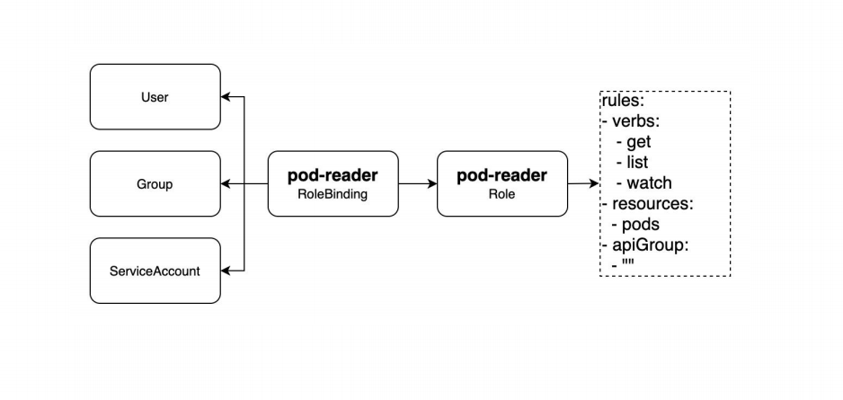
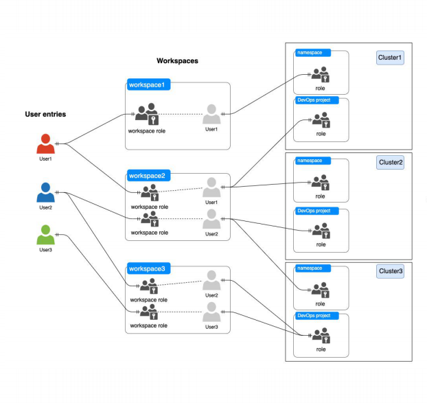
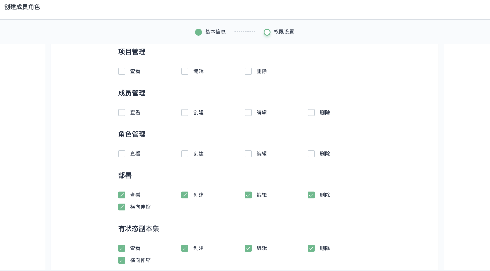
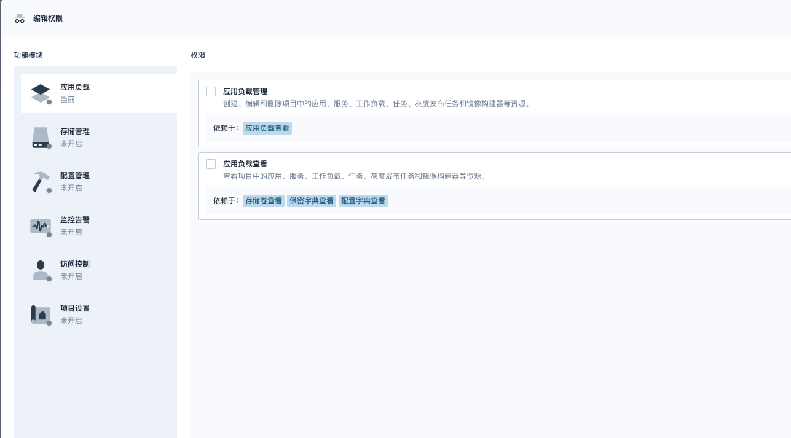

## 权限控制

### RBAC

https://kubernetes.io/docs/reference/access-authn-authz/rbac/




### KS中的租户与资源层级




Platform: users、workspaces、clusters

Cluster: nodes、workloads、namespaces

Workspace: namespaces、apps

Namesapce: workloads

### API Pattern

https://kubernetes.io/docs/reference/using-api/api-concepts/

```
# KS API
/kapis/{apiGroup}/{apiVersion}/{resourcePlural}/{resourceName}/{subResource}

# K8s 原生 API
/apis/{apiGroup}/{apiVersion}/{resourcePlural}/{resourceName}/{subResource}
/api/{apiGroup}/{apiVersion}/{resourcePlural}/{resourceName}/{subResource}

# 多集群分发
/apis/clusters/{cluster}/{apiGroup}/{apiVersion}/{resourcePlural}/{resourceName}/{subResource}
/kapis/clusters/{cluster}/{apiGroup}/{apiVersion}/{resourcePlural}/{resourceName}/{subResource}
```

**API 示例**

Platform Scope

特殊的 CRD，这类资源被 host 集群管理，受到 GlobalRole 的限制

```
/kapis/iam.kubesphere.io/v1alpha2/users
/kapis/resources.kubesphere.io/v1alpha3/clusters
/kapis/tenant.kubesphere.io/v1alpha2/workspaces
```

Workspace Scope

KS 中的资源层级，受到 WorkspaceRole 的限制

```
/kapis/openpitrix.kubesphere.io/v1/workspaces/{workspace}/apps
/kapis/tenant.kubesphere.io/v1alpha2/workspaces/{workspace}/namespaces
```

Cluster Scope

K8s 中的资源层级，收到 ClusterRole 的限制

```
/api/v1/nodes
/apis/apps/v1/deployments
```

Namespace Scope

```
/apis/apps/v1/namespaces/{namespace}/deployments
```

### 插件的权限控制

KubeSphere 2.x




KubeSphere 3.x



KubeSphere 4.x

在 3.x 的基础之上进一步细化

通过授权项对强相关的资源授权规则进行聚合，这是粗粒度
授权粒度分为创建(create)、查看(list、get、watch)、编辑(update、patch)、删除(delete)、管理(\*) 五个部分，这个是细粒度
授权项、功能模块可以在不通的插件中进行声明，动态拓展

** RoleTemplate **

```yaml
apiVersion: iam.kubesphere.io/v1
kind: RoleTemplate
metadata:
  annotations:
    iam.kubesphere.io/scope: Platform
    iam.kubesphere.io/module: Access Control
    iam.kubesphere.io/rules: '{"users": "view"}'
  name: role-template-view-users

rules:
- apiGroups:
  - '*'
  resources:
  - users
  verbs:
  - get
  - list
  - watch
```

```yaml
apiVersion: iam.kubesphere.io/v1
kind: RoleTemplate
metadata:
  annotations:
    iam.kubesphere.io/scope: Namespaced
    iam.kubesphere.io/module: Pipelines
    iam.kubesphere.io/rules: '{"pipelines": "view"}'
  name: role-template-view-pipelines

rules:
- apiGroups:
  - 'devops.kubesphere.io'
  resources:
  - 'pipelines'
  verbs:
  - get
  - list
  - watch
```