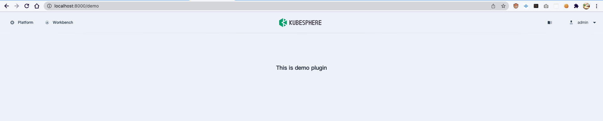

# 插件开发示例

## 1. 部署 kubesphere v3.2.1

最小化[安装 KubeSphere v3.2.1](https://kubesphere.com.cn/docs/quick-start/all-in-one-on-linux/)

## 2. 更新 ks-apiserver 与 ks-controller-manager 的镜像

镜像 `docker.io/wansir/ks-apiserver:experimental`、`docker.io/wansir/ks-controller-manager:experimental` 用于验证可插拔部分的架构设计

代码分支 [https://github.com/wansir/kubesphere/tree/feat-pluggable](https://github.com/wansir/kubesphere/tree/feat-pluggable)

```
kubectl -n kubesphere-system set image deploy/ks-apiserver ks-apiserver=docker.io/wansir/ks-apiserver:experimental
kubectl -n kubesphere-system set image deploy/ks-controller-manager ks-controller-manager=docker.io/wansir/ks-controller-manager:experimental
```

## 3. 对外暴露 ks-apiserver

在前端本地开发的过程中，依赖 ks-apiserver 提供的 API，需要将 ks-apiserver.kubesphere-system.svc 暴露给开发环境。


## 4. clone 前端代码到本地

代码分支 [https://github.com/chenz24/console/tree/plugin-marketplace](https://github.com/chenz24/console/tree/plugin-marketplace) 用与验证可插拔部分的架构设计

```
git clone https://github.com/chenz24/console.git
cd console && git checkout plugin-marketplace
```

## 5. 插件开发示例

前端项目开发依赖 yarn、 node12

### 5.1 目录结构

`plugins/demo` 目录下是一个简单的插件示例

```
├── plugins                      # 插件目录：可包含多个插件
│   ├── Dockerfile               # 将插件打包为 Helm Repo 通过 Docker Image 进行分发
│   ├── demo                     # demo 插件目录
│   │   ├── Chart.yaml           # 定义插件的基础信息
│   │   ├── Dockerfile           # 打包插件所涉及的工作负载，用于提供 API 或静态资源
│   │   ├── README.md
│   │   ├── charts
│   │   ├── dist
│   │   │   └── index.js         # 通过 webpack 打包后的 js 文件
│   │   ├── package-lock.json
│   │   ├── package.json
│   │   ├── server
│   │   │   └── app.js
│   │   ├── src                  # 插件源代码
│   │   │   ├── App.jsx
│   │   │   ├── index.js
│   │   │   └── routes
│   │   ├── templates            # 定义如何部署插件
│   │   │   ├── NOTES.txt
│   │   │   ├── _helpers.tpl
│   │   │   ├── deployment.yaml  # 插件部署文件
│   │   │   ├── extensions.yaml  # API注册、JSBundle注册
│   │   │   ├── service.yaml     
│   │   │   └── tests
│   │   └── values.yaml
│   └── entry.ts
```

插件中(`plugins/demo/src/routes/index.js`)注册了路径为 `/demo` 的页面路由

```javascript
import React from 'react';
import App from '../App';

export default [
  {
    path: '/demo',
    element: <App />,
  },
];
```

一个简单的插件页面(`plugins/demo/src/App.jsx`)

```javascript         
import React from 'react';

export default function App() {
  return <h3 style={{ margin: '8rem auto', textAlign: 'center' }}>This is demo plugin</h3>;
}
```


### 5.2 本地预览

插件在开发时可以通过本地文件的方式进行加载，无需通过 ks-apiserver 进行远程加载。

```
yarn dev
```

访问 `http://localhost:8000/demo` 可以正常打开插件页面



### 5.3 插件打包

在本地验证插件可以正常显示之后，通过 Helm 对插件进行打包。

```
cd plugins/demo
yarn build
```

插件打包完成会在 `dist` 目录下生成 `index.js`

此时需要提供一个后端服务，提供打包之后 `index.js` 文件的下载路径，可以使用 nginx 或者 node 等提供一个静态资源访问地址。

示例中通过一个简单的 node server 提供了 `index.js` 的访问地址：`/dist/demo.kubesphere.io/v1alpha2/index.js`

将 `server/app.js` 与 `dist/index.js` 一起打包到一个镜像中，并创建出关联的 K8s 资源模板 `plugins/demo/templates/deployments.yaml`、`plugins/demo/templates/services.yaml`，部署该工作负载之后可以通 service 地址获取到 `index.js`

```bash
cd plugins/demo
docker build -t <REPO>:<TAG> .
docker push <REPO>:<TAG> .
```

`plugins/demo/templates/extensions.yaml` 文件中 `JSBundle` 声明了该插件以及 `index.js` 加载的路径

```yaml
apiVersion: extensions.kubesphere.io/v1alpha1
kind: JSBundle
metadata:
  name: demo.kubesphere.io
spec:
  rawFrom:
    url: http://{{ include "demo.fullname" . }}.{{ .Release.Namespace }}.svc # 部署之后的静态资源服务访问地址
status:
  enabled: true
  link: /dist/demo.kubesphere.io/v1alpha2/index.js                           # 通过 ks-apiserver 代理之后 index.js 的加载地址（验证过程中需要手动指定，插件机制完善之后该地址会自动生成）
```

### 5.4 插件部署

在完成对插件的 Helm 打包之后，可以通过以下命令在远程环境中部署该插件

```bash
helm upgrade demo demo --create-namespace -n kubesphere-plugins --install --set image.repository=<REPO> --set image.tag=<TAG>
```

完成安装之后可以通过一下命令来验证是否安装正确

```bash
$ kubectl get jsbundle
NAME                 AGE
demo.kubesphere.io   7m36s
$ kubectl -n kubesphere-plugins get all
NAME                        READY   STATUS             RESTARTS   AGE
pod/demo-5cf6d76fc7-7594t   1/1     Running            0          3m54s

NAME           TYPE        CLUSTER-IP      EXTERNAL-IP   PORT(S)   AGE
service/demo   ClusterIP   10.233.18.102   <none>        80/TCP    8m2s

NAME                   READY   UP-TO-DATE   AVAILABLE   AGE
deployment.apps/demo   1/1     1            1           8m2s

NAME                              DESIRED   CURRENT   READY   AGE
replicaset.apps/demo-5cf6d76fc7   1         1         1       3m54s
```

可以观察到 jsbundle 资源和 demo 插件依赖的 workloads 及 service 都已经正常创建

### 5.5 加载远程插件

在完成插件的部署之后， ks-console 便可以通过 ks-apiserver 提供的 API 发现需要加载的插件

通过一下方式可以在本地开发过程中加载远程环境中部署好的插件。

创建本地配置文件 `cp config/config.yaml config/local_config.yaml` 并替换 `apiServer.url` 地址为开发环境中 ks-apiserver 的地址

通过以下命令启动 ks-console

```bash
yarn build:dll
yarn build
yarn start
```

访问 demo 插件注册的路由地址 `http://localhost:8000/demo` 可以正常加载插件页面

以下日志可以追踪插件的加载过程

```bash
Dashboard app running at port 8000
  <-- GET /demo 2022/03/11T18:50:57.833
  --> GET /demo 200 471ms 16.88kb 2022/03/11T18:50:58.303
  <-- GET /pstatic/dist/demo.kubesphere.io/v1alpha2/index.js 2022/03/11T18:50:58.729
GET /pstatic/dist/demo.kubesphere.io/v1alpha2/index.js -> http://139.198.13.78:30881/dist/demo.kubesphere.io/v1alpha2/index.js
success:  GET /pstatic/dist/demo.kubesphere.io/v1alpha2/index.js -> http://139.198.13.78:30881/dist/demo.kubesphere.io/v1alpha2/index.js 200 103
```


