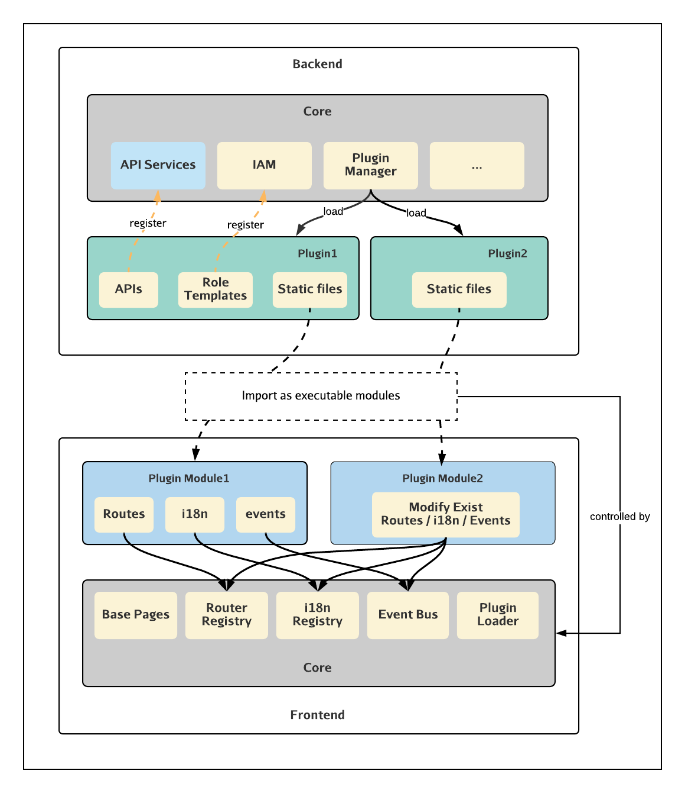

# Summary

可插拔架构是 KubeSphere 4.0 中最重要的改动，目的是让 KubeSphere 可以动态的进行功能扩展，提供完善的插件机制便于第三方的应用接入，构建更加完善的生态。

- Data Management
- Project Management
- DevOps
- ...

## Core Capabilities

1. 前端插件化：前端项目支持插件化，可通过插件在各级导航栏插入新的功能入口，实现功能页面的动态添加。
2. 后端插件化：后端支持 API 拓展机制，提供统一的 API 聚合，认证鉴权框架。
3. 插件管理：提供可视化的插件管理机制，支持插件的安装、卸载、启用、停用、配置、升级
4. 插件仓库：提供插件的打包、发布机制，提供内置的插件仓库。
5. 插件框架：提供插件开发、打包、发布相关的脚手架，提供完善的插件开发文档。

## Architecture



## Frontend

前端采用微内核+插件的架构重构整个前端。架构图如下：


内核仅提供插件注册、运行时上下文、事件总线、路由管理、国际化管理、基础页面(如登录、布局页面)、BFF等核心功能，所有业务代码以插件形式接入。如：Clusters、DevOps、DMP。
插件区分本地插件和远程插件，他们的开发模式基本相同但存在以下不同：
- 本地插件的代码和 ks-core 在同一个 repo 并且会和 ks-core 同时打包。
- 远程插件的代码和 ks-core 在不同的 repo，会单独打包发布，然后在 ks-core 运行时远程加载。

同时，为了提高开发效率降低开发门槛我们对基础组件库 KubeDesign 做了全新的封装，对通用业务组件也会做一些封装。
另外我们会提供开发脚手架，方便开发者快速构建插件。


## Backend

后端的插件化主要包含 API 的注册、静态资源的代理两个部分，可以把 ks-apiserver 看作一个可拓展的 API 网关，由 ks-apiserver 提供统一的 API 认证鉴权能力，支持动态的 API 拓展。



### Plugin Model

**插件** 通过 CRD 进行定义，主要包含三个部分：`APIService`、`JSBundle` 和 `ReverseProxy`。

#### APIService

APIService 是一种类似于 [K8s Aggregated API](https://kubernetes.io/docs/concepts/extend-kubernetes/api-extension/apiserver-aggregation/) 的一种 API 拓展机制，可以声明式的注册[资源型的 API](https://kubernetes.io/zh/docs/reference/using-api/api-concepts/)，便于通过 [KubeSphere 的权限控制体系](#TODO)进行统一的 API 权限控制，一个插件中可以包含多个 APIService。

```yaml
apiVersion: extensions.kubesphere.io/v1alpha1
kind: APIService
metadata:
  name: v1alpha1.devops.kubesphere.io
  annotations:
    meta.helm.sh/release-name: devops-0.10.0                # 通过 Subscription 订阅插件之后，插件 chart 中包含的 APIService 通过 helm 创建出来
spec:
  group: devops.kubesphere.io                               # API Group
  version: v1alpha1                                         # API Version
  endpoint: https://ks-devops.kubesphere-devops-system.svc  # backend
  insecureSkipTLSVerify: true
status:
  enabled: true
```

#### JSBundle

JSBundle 定义了需要注入到前端框架中的 js bundle。为了便于开发，体积较小的 js 文件可以直接嵌入到 ConfigMap 或 Secret 中，体积较大的 js 文件则需要通过额外的后端服务来提供。插件被启用之后，ks-apiserver 会代理相关的静态资源请求，前端框架则借助此 API 动态的加载 js 文件。

```yaml
apiVersion: extensions.kubesphere.io/v1alpha1
kind: JSBundle
metadata:
  name: v1alpha1.devops.kubesphere.io
  annotations:
    meta.helm.sh/release-name: devops-0.10.0  
spec:
  rawFrom:
    url: https://ks-devops.kubesphere-devops-system.svc/dist/devops.kubesphere.io/v1alpha1/index.js
  #   configMapKeyRef:
  #     name: devops
  #     key: index.js
  #     namespace: kubesphere-devops-system
  #   secretKeyRef:
  #     name: 
  #     key: 
  #     namespace: kubesphere-devops-system
  # TODO(@chenz24)
status:
  enabled: true
  link: /dist/devops.kubesphere.io/v1alpha1/index.js
```

#### ReverseProxy

提供非资源型 API 的方向代理，可以用来代理一些静态的资源文件，支持路径的 Rewrite，支持请求头的注入。

API 的路径会在解析插件的时候就进行检查，避免冲突。

```yaml
apiVersion: extensions.kubesphere.io/v1alpha1
kind: ReverseProxy
metadata:
  name: devops.kubesphere.io
spec:
  matcher:
  - path: /res/devops.kubesphere.io/images/*
    method: GET
  upstream:
    insecureSkipVerify: false
    caBudle: <Base64Data>
    backend: https://ks-devops.kubesphere-system.svc
    healthCheck:
      url: /healthz
      interval: 15s
      status: 200
      timeout: 15s
  rewrite:
    - '/old-prefix/* /new-prefix{path}'
  header:
    up:
    - 'Foo: Bar'
    down:
    - 'Foo: Bar'
status:
  enabled: true
```
