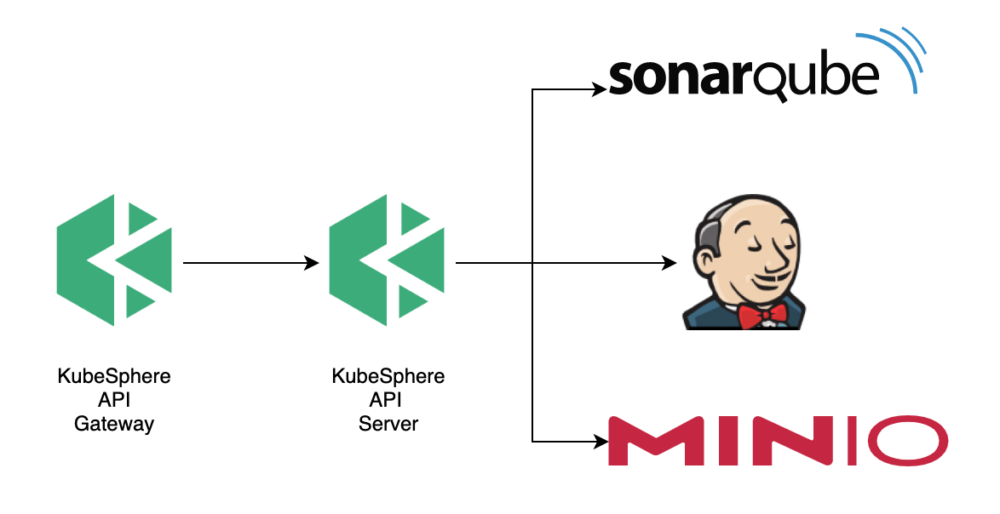

# KubeSphere DevOps Pipeline Overview

KubeSphere DevOps Pipeline aims to meet the complex CI/CD requirements on Kubernetes. With the KubeSphere DevOps Pipeline, you can quickly construct a complete CI/CD workflow via the KubeSphere console.

## DevOps Pipeline Capabilities

* Build, deploy, launch services in Kubernetes
* Use Kubernetes dynamic agent to release the ability of Kubernetes to dynamically expand
* Support In SCM Pipeline and Out of SCM Pipeline
* Easy-to-use graphical pipeline editing panel
* Multi-tenant isolation

### DevOps Pipeline API

The KubeSphere DevOps Pipeline API encapsulates the following APIs to provide a standardized REST API:

* Jenkins Core API
* Jenkins BlueOcean API
* Sonarqube API
* Other Plugins API

KubeSphere apiserver provides multi-tenant API, pipeline API, credential API, code quality analysis API, etc.

### Multi-tenant isolation

In the versions (v2.1.x), multi-tenancy in the DevOps part is done with the ability of the [role-strategy-plugin](https://github.com/jenkinsci/role-strategy-plugin). KubeSphere automatically synchronizes permission rules in this plugin.

In the future, KubeSphere DevOps will authenticate based on [OPA](https://www.openpolicyagent.org/).

### Integration with Jenkins

KubeSphere integrates with standard Jenkins, customizing plugins and configurations.

#### Distribution of plugins

To meet the needs of users in private cloud environments, KubeSphere uses the built-in Nginx as a Jenkins update center which is provided as a Docker image + [Helm Chart](https://github.com/kubesphere/ks-installer/tree/master/roles/ks-devops/jenkins-update-center).

#### Jenkins configuration

KubeSphere uses Docker Image, Jenkins update Center and Helm Chart to distribute Jenkins.

The list of plugins and configuration required by Jenkins are provided by [Helm Chart](https://github.com/kubesphere/ks-installer/tree/master/roles/ks-devops/jenkins).

We use [Groovy Script](https://wiki.jenkins.io/display/JENKINS/Groovy+Hook+Script) and [JCasC](https://github.com/jenkinsci/configuration-as-code-plugin) to initialize Jenkins.

### Pipeline Builder Image and Jenkins PodTemplate

Jenkins does not include any agent configuration by default. KubeSphere provides some default agents including docker image and podTemplate configuration.

The default agent image is built based on the [builder base](https://github.com/kubesphere/builder-base). You can search the keyword of repository `builder xxx`  in KubeSphere [GitHub](https://github.com/kubesphere/).

### In SCM Pipeline and Out of SCM Pipeline

KubeSphere's pipeline syntax is fully compatible with Jenkins' pipeline syntax. Jenkinsfile found in SCM is supported with Jenkins plugin.

We provide a plug-in SCM API, allowing users to graphically edit Jenkinsfile, Dockerfile and other configurations in SCM on KubeSphere.

### Sonarqube Integration

KubeSphere retrieves Jenkins pipelines that have performed Sonarqube code analysis, and provides APIs to access analysis report.

### More

If you have more questions, you can create an issue on [GitHub](https://github.com/kubesphere/kubesphere).
