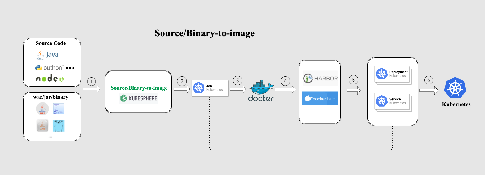

# KubeSphere S2I/B2I Overview

## What is S2I/B2I

KubeSphere S2I (Source-to-Image) / B2I (Binary-to-Image) provides easy-to-use CI/CD functionalities, helping developers to publish their services to Kubernetes without writing Dockefile.

## Workflow Example

## Principle

All resources of S2I/B2I will be installed in namespace `kubesphere-devops-system` when DevOps component enabled.

In S2I, all resources and CI/CD steps are defined with [Custom Resource Defintion](https://kubernetes.io/docs/concepts/extend-kubernetes/api-extension/custom-resources/) (CRD). You can operate all S2I resources by calling K8s API directly.

There are two modules included in the S2I component:

1. S2I operator: A Kubernetes CRD controller that provides easy Kubernetes-style resources for declaring CI/CD-style pipelines.
2. S2IRun: It is the instance that executes the S2I build process in containers.

Besides, the S2I stack includes the following CRD resources:

1. s2ibuildertemplates: defines information about S2I builder image.
2. s2ibuilders: all configuration information used in building is stored in this CRD.
3. s2iruns: defines an action about build.

Here is a graph that describes the relationship about all CRDs within S2I architecture:

​

Also you can install S2I component in any Kubernetes cluster without installing KubeSphere.

If you want to see more about S2I, please go to [S2I Operator](https://github.com/kubesphere/s2ioperator) and [S2IRun](https://github.com/kubesphere/s2irun).
