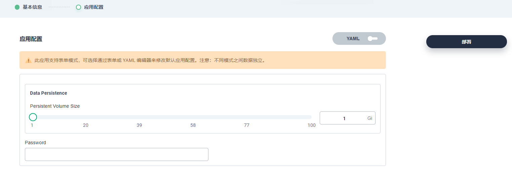

# Deploy Redis in KubeSphere

本文介绍在kubesphere中通过应用商店部署Redis的操作步骤。

## 前提条件

- 已安装了 OpenPitrix（应用商店）功能组件。若未开启**应用商店**功能组件，可参考[开启组件](https://kubesphere.io/docs/pluggable-components/app-store/)进行开启。
- 已创建了单集群企业空间、单集群项目和普通用户 `project-regular`账号。
- 使用项目管理员 `project-admin`邀请项目普通用户 `project-regular`加入项目并授予 `operator`角色。

## 操作说明

1. 使用 `project-regular`账号进入已创建的项目 `demo-project `后，选择**应用负载**，点击**应用**，点击 **部署新应用**，然后在弹窗中选择 **来自应用商店**。

   

2. 进入应用商店页面。

   

3. 选择并点击**redis**应用，进入应用信息页面。

   

   在**应用详情**--**配置文件**中，可以查看redis应用的helm chart的配置文件。

   

4. 点击页面右上角的部署按钮，进入基本信息设置页面。

   在此页面中，你可进行如下设置：

   - 在应用名称输入框中，可修改应用名称；
   - 当应用包含多个版本时，可点击应用版本下拉框，选择所需的版本进行部署；
   - 在描述信息中，可设置部署应用的描述信息；
   - 点击部署位置，可选择应用部署的企业空间和项目。

   

5. 点击**下一步**，进入到应用配置页面。

   目前，支持2种配置方式：可视化配置和yaml配置。通过点击**YAML**按钮，来实现配置方式的转换。

   在应用配置页面中，可设置redis的密码。

   

   

6. 点击**部署**，自动跳转到`demo-project`的应用列表页面。

   在应用列表中，可以查看应用状态为**创建中**；

   待应用部署完成后，应用的状态会更新为**活跃**状态。

   

## 使用redis

1. 在容器组列表中，选择redis应用对应的容器组，点击进入详情页面中。点击**终端**图标，进入容器终端。

   

2. 在容器终端中，可以直接使用`redis-cli`命令来操作部署的redis应用。

