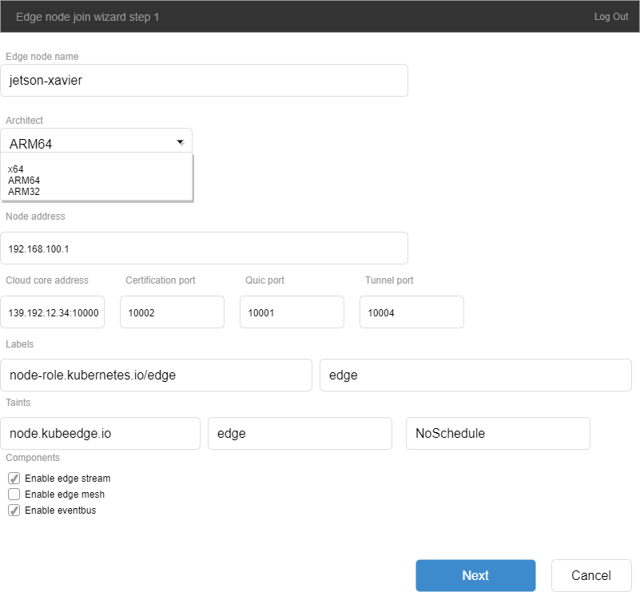

KubeSphere & KubeEdge Integration

# Summary

This proposal describes KubeEdge integration with KubeSphere. The aim is to add KubeEdge support to enable edge computing feature. The bundle of integration is listed below:

- Enable and configure KubeEdge CloudCore via UI
- Edge nodes logging and metrics
- Convenient edge node joining and exiting

# E1. Enable and configure KubeEdge CloudCore via UI
Users can toggle enable/disable and modify parameters of KubeEdge CloudClore on KubeSphere UI. Each cluster can config its KubeEdge component separately, only users with cluster-admin role can config KubeEdge. Configure parameters are shown below:

## CloudCore config

| Parameter | Description | Type | Default |
| --------- | ----------- | ---- | ------- |
| CloudCore HA | HA deployment of CloudCore | Bool | False |
| CloudCore Service Type | Service expose method | String | NodePort (NodePort/LoadBalancer) |
| CloudHub advertiseAddress | Exposed IP address for EdgeCore to connect | String | Public IP address of KS cluster in NodePort mode / Service attached LB IP |
| CloudHub nodeLimit | node limit for edge nodes | Int | 100 |
| Enable CloudHub websocket | Enable CloudHub websocket, basic service | Bool | True |
| Enable CloudHub https | Enable CloudHub https, basic service | Bool | True |
| Enable CloudHub Quic | Enable CloudHub Quic | Bool | False |
| Enable CloudStream | Enable CloudStream component, required by logs and metrics | Bool | True |
| CloudHub websocket port | Port number of CloudHub websocket service | Int | 31000(NodePort) / 10000(LB) |
| CloudHub Quic port | Port number of CloudHub Quic service | Int | 31001(NodePort) / 10001(LB) |
| CloudHub https port | Port number of CloudHub https service | Int | 31002(NodePort) / 10002(LB) |
| CloudStream port  | Port number of CloudStream service | Int | 31003(NodePort) / 10003(LB) |
| CloudTunnel port  | Port number of CloudTunnel service | Int | 31004(NodePort) / 10004(LB) |

## Edge-Watcher config

| Parameter | Description | Type | Default |
| --------- | ----------- | ---- | ------- |
| Destination node address | Destination address of log/metrics request | String | Master/Worker node address of cluster |
| Destination node port | Destination port of log/metrics request | String | 31003 |
| Log port | Port of log request | String | 10350 |
| Metrics port | Port of metrics request | String | 10250 |

- KubeEdge and edge-watcher are installed by one helm chart.
- After KubeEdge enabled, UI should prompt users to enable firewall and port mapping for KubeEdge service ports.

# E2. Edge nodes logging and metrics

## Network configuration for logging and metrics

Edge node reported IP is not an actual IP address which could be accessed by k8s apiserver and metrics-server in k8s cluster, and edge nodes can not be connected from k8s through Internet, calling to logs/metrics API must be forwarded by CloudStream service on top of the connection created from edge nodes to CloudCore, the data chain is like following:
k8s apiserver -> edgenode-reported-ip:10350 -> CloudCore:10003 | CloudStream:10004 <- EdgeCore log endpoint -> edgenode:10350
metrics-server -> edgenode-reported-ip:10250 -> CloudCore:10003 | CloudStream:10004 <- EdgeCore metrics endpoint -> edgenode:10250

Each edge node required 2 iptables entries to enable logging and metrics fetching.
TCP 192.168.100.1:10250 -> cloudcore-ip:10003(Can be 192.168.1.10:31003 in NodePort mode)
TCP 192.168.100.1:10350 -> cloudcore-ip:10003(Can be 192.168.1.10:31003 in NodePort mode)

Edge-watcher and iptables-operator components are developed to maintain iptables entries according to edge nodes status, and installs together with kubeedge when enables it.


## Edge node logging

KubeSphere can view container logs in pod resource status, container logs interface, which uses the same APIs with kubectl logs.

Because fluent-bit log collector is not deployed on edge nodes, and direct network connection from edge nodes to ElasticSearch is not available, users currently can not search edge nodes' log from Log Search tool.


## Edge node metrics

KubeSphere fetches edge nodes' real-time metrics values using same APIs like kubectl top.

```
	var err error
	versionedMetrics := &metricsV1beta1api.NodeMetricsList{}
	mc := metricsClient.MetricsV1beta1()
	nm := mc.NodeMetricses()
	if resourceName != "" {
		m, err := nm.Get(resourceName, metav1.GetOptions{})
		if err != nil {
			return nil, err
		}
		versionedMetrics.Items = []metricsV1beta1api.NodeMetrics{*m}
	} else {
		versionedMetrics, err = nm.List(metav1.ListOptions{LabelSelector: selector.String()})
		if err != nil {
			return nil, err
		}
	}
	metrics := &metricsapi.NodeMetricsList{}
	err = metricsV1beta1api.Convert_v1beta1_NodeMetricsList_To_metrics_NodeMetricsList(versionedMetrics, metrics, nil)
	if err != nil {
		return nil, err
	}
	return metrics, nil
```

Original metrics data from edge nodes to metrics server on 10250 port are shown below.

API: edgenode-reported-ip:10250/stats/summary

Node level metrics (real-time data)

| Object | Metrics |
| ------ | ------- |
| Node CPU | usageNanoCores |
| Node CPU | usageCoreNanoSeconds |
| Node Memory | usageBytes |
| Node Memory | workingsetBytes |
| Node Network | rxBytes |
| Node Network | txBytes |
| Node FS | availableBytes |
| Node FS | capacityBytes |
| Node FS | usedBytes |

Pod level metrics (real-time data)

| Object | Metrics |
| ------ | ------- |
| Pod CPU | usageNanoCores |
| Pod CPU | usageCoreNanoSeconds |
| Pod Memory | usageBytes |
| Pod Memory | workingsetBytes |
| Pod Network | rxBytes |
| Pod Network | txBytes |
| Pod Volume/ephemeral-storage | availableBytes |
| Pod Volume/ephemeral-storage | capacityBytes |
| Pod Volume/ephemeral-storage | usedBytes |

API: edgenode-reported-ip:10250/stats/{pod_name}/{container_name}

Retrieves most recent 8 records of container metrics data covers about 40 seconds.

| Object | Metrics |
| ------ | ------- |
| Container CPU | Usage |
| Container Memory | Usage |
| Container Memory | Swap |
| Container Network | rxBytes |
| Container Network | txBytes |
| Container DiskIO IO service bytes | Read |
| Container DiskIO IO service bytes | Write |
| Container DiskIO IO service bytes | Total |
| Container DiskIO IO serviced | Read |
| Container DiskIO IO serviced | Write |
| Container DiskIO IO serviced | Total |
| Container FileSystem | Usage per device |

Major metrics data used by kubectl top from metrics-server API are shown below.

Node level metrics (real-time data)

| Object | Metrics |
| ------ | ------- |
| Node CPU | Usage |
| Node Memory | Usage |

Pod level metrics (real-time data)

| Object | Metrics |
| ------ | ------- |
| Pod CPU | Usage |
| Pod Memory | Usage |

# E3. Convenient edge node joining and exiting



Set edge node parameter on UI.


Download installer and config file, copy to edge node and join.


