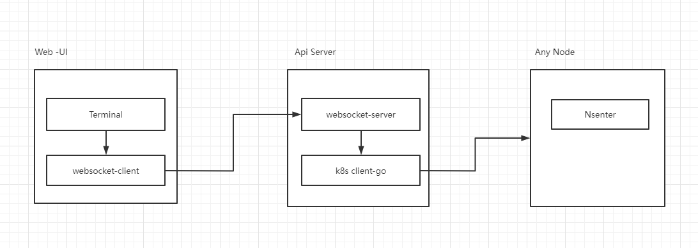
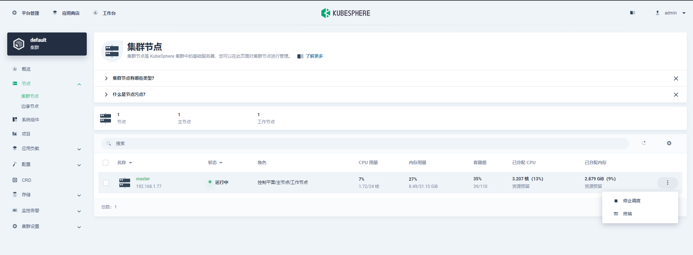
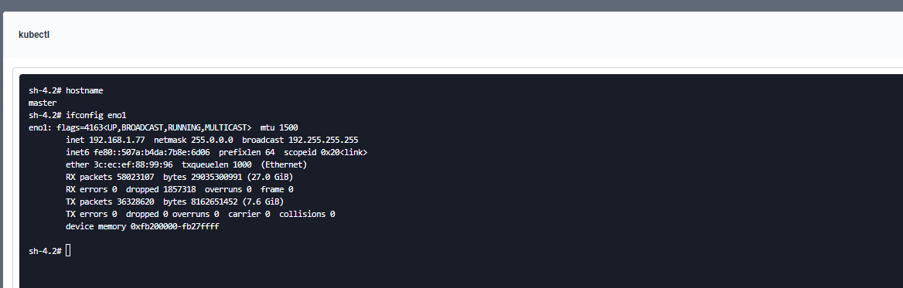
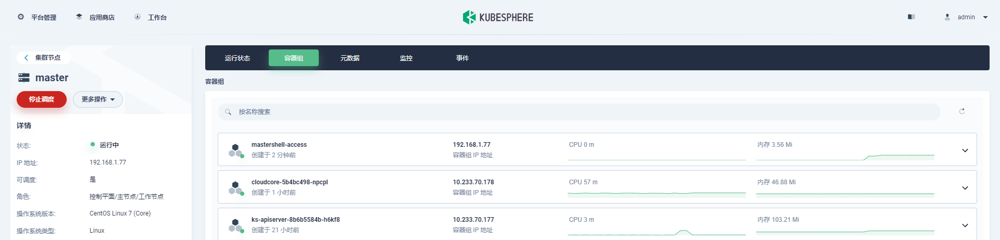
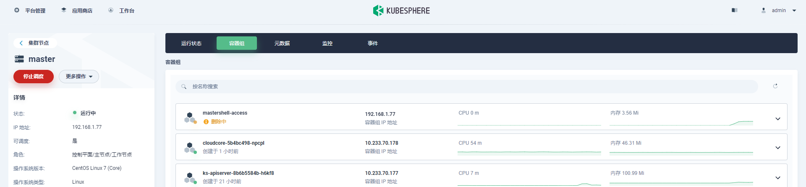
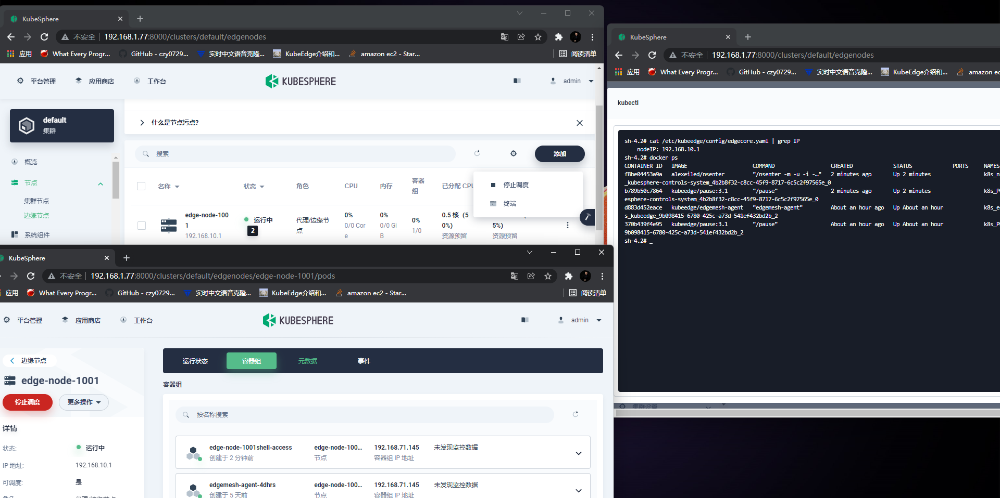
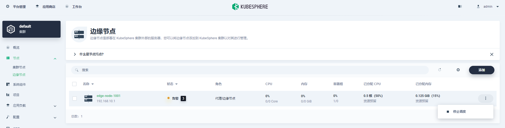

# Motivation
This function can make it easier for us to manage the host on Web UI, 
it could be for maintenance, configuration inspection, log collection, or other troubleshooting operations.

# Goals
+ Add a button in the nodes interface to open the terminal linked to the node
+ It can work on k8s cluster nodes and edge nodes

# Design detail
## Technology selection

At first, I planned to use edgemesh's SSH tunnel proxy, but it can't work on k8s cluster nodes.
Later, at the [suggestion](https://github.com/kubesphere/kubesphere/issues/4569) of the community I use nsenter to do this. 
The nsenter is a small program from util-linux package, that can run program with namespaces (and cgroups) of other processes. Exactly what we need!

## Workflow

**step0:**  
The client initiates a terminal link request to the ks-apiserver

**step1:**  
ks-apiserver will perform permission verification after accepting the request, If the user has permission to create a pod it will creates an nsenter instance on the corresponding node

**step2:**  
When the nsenter state changes to running, connect to the container through kubectl exec(ps: Using kubesphere's encapsulated method)

**step3:**  
Delete the nsenter instance when the client disconnects

## Other Details
###Condition monitoring  
Because the instance creation takes time and the front-end page can be accessed concurrently, I used for true {getpodstatus()} to detect it instead of list watch.This eliminates the need to notify two threads in one event.

### When to delete an nsenter
At present, I use atomic counting to delete instances when no client is connected to nsenter. Whether the function of scheduled deletion is required?
If necessary, We need to add the detection of whether the client is active in the original program

# Demo

### shell access to k8s cluster node

### Exit automatic deletion

### shell access to edge node

The terminal button is not displayed when the node status is incorrect
