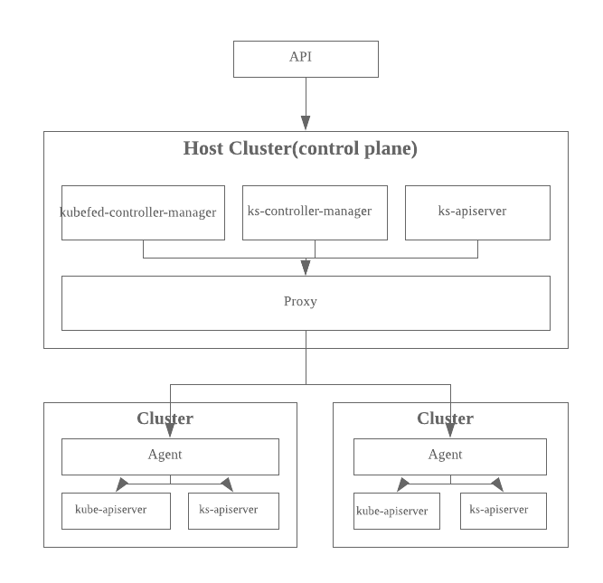

# Multiple Cluster Architecture

## Introduction

Today, it's very common for organizations to run a handful of Kubernetes Clusters. Each kubernetes cluster is a relatively self-contained unit. And there are several teams working on tying all clusters, such as kubefed. More and more KubeSphere users and customers have expressed their keen interests in managing all clusters through KubeSphere.

For KubeSphere users and customers, the two highest priority ones are operating clusters in one place and providing high availability at the same time.

## What is KubeSphere multiple cluster

KubeSphere multiple cluster is the ability to operate clusters in one place, which is KubeSphere, and extend kubefed to achieve high availability.

## Architecture

The overall architecture of a control plane is shown as the following.



Some design principles we are following in this architecture.

1. Keep the underlying KubeSphere clusters independent. They should have no knowledge of control plane or each other.
2. Keep the API interface compatible with KubeSphere API as much as possible.

## API Objects

### Cluster

Cluster is the new first-class API object introduced in this design. For each registered KubeSphere cluster there will be such an API resource in control plane. The corresponding resources path is `/apis/cluster.kubesphere.io/clusters/{cluster}`. The spec of a cluster shows as the following.

|Name|Description|Required|Schema|Default|
|---|---|---|---|---|
|Federated|Whether to join federation control plane|yes|bool|false|
|Active|Enable a cluster|yes|bool|yes|

### Agent

Agent is also a new first-class API object introduced in this design. For each registered KubeSphere cluster, there will be an agent created in control plane. Agent needs to be paired with real agent workload running in the registered cluster. The agent running in registered cluster will establish a secured ssh tunnel with control plane for future communication. Also, agent contains necessary credential(kubeconfig) to connect a member cluster apiserver.

## API compatibility

One of design goals is to keep the maximum compatibility with original KubeSphere API. Under multicluster environment, API request with extra path `/clusters/{cluster}` will be forwarded to designated cluster through agent. For example, requests like the following

```bash
GET /api/v1/namespaces/default
GET /kapis/servicemesh.kubesphere.io/v1alpha1/namespaces/default/strategies/canary
```

are handled by host cluster (control plane) directly. There is no routing needed. Requests like the following

```bash
GET /api/clusters/gondor/v1/namespaces/default
GET /kapis/clusters/gondor/servicemesh.kubesphere.io/v1alpha1/namespaces/default/strategies/canary
```

are forwarded to cluster named **gondor** with `/clusters/gondor` stripped, which are

```bash
GET /api/v1/namespaces/default
GET /kapis/servicemesh.kubesphere.io/v1alpha1/namespaces/default/strategies/canary
```

> The reason why we put `/clusters/{cluster}` right after `/apis` is that there are resources named `clusters`. If we put `/clusters/{cluster}` right after api-version, it will look like
>
> ```bash
> GET /api/v1/clusters/gondor/namespaces/default
> GET /kapis/servicemesh.kubesphere.io/v1alpha1/clusters/gondor/namespaces/default/strategies/canary
> ```
>
> which seems fine. But what if we want to get cluster resource,
>
> ```bash
> GET /api/v1/clusters/gondor
> ```
>
> Now, it's hard to tell the intention of this request. Does it want to forward to cluster gondor or just gets clusters object named gondor? So it is better to put `/clusters/{cluster}` right after `/apis`.