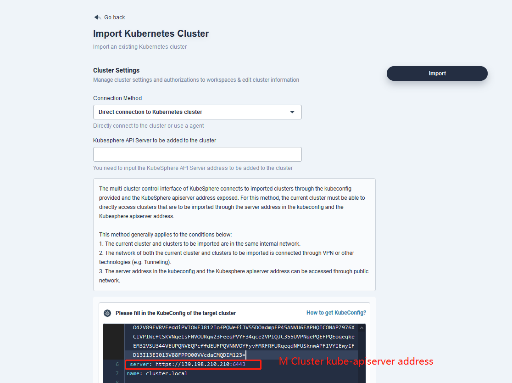
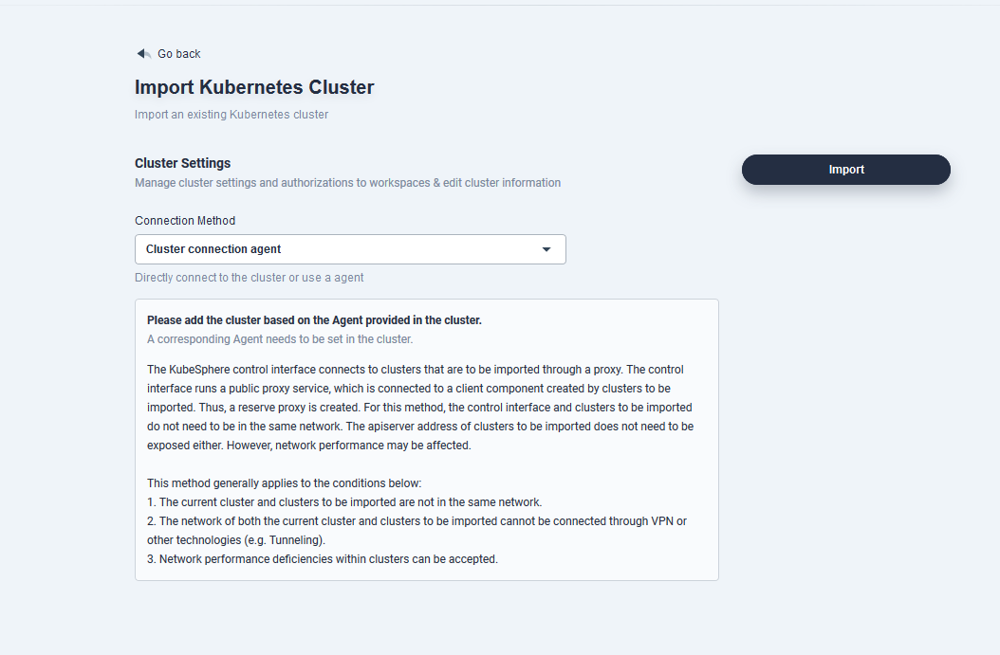

# How to Enable the Multi-cluster Feature

<!-- vscode-markdown-toc -->

* 1. [Overview](#Intro)
* 2. [Direct Connection](#direct)
  * 2.1. [Install Host Cluster](#HostCluster)
  * 2.2. [Install Member Cluster](#MemberCluster)
  * 2.3. [Import Cluster](#AddCluster)
* 3. [Agent Connection](#agent)
  * 3.1. [Install Host Cluster](#HostCluster-Agent)
  * 3.2. [Install Member Cluster](#MemberCluster-Agent)
  * 3.3. [Import Cluster](#AddCluster-Agent)

<!-- vscode-markdown-toc-config
	numbering=true
	autoSave=true
	/vscode-markdown-toc-config -->
<!-- /vscode-markdown-toc -->

## 1. <a name='Intro'></a>Overview

The multi-cluster feature relates to the network connection among multiple clusters. Therefore, it is important to understand the topological relations of clusters as the workload can be reduced.

Before you use the multi-cluster feature, you need to create a Host Cluster (H Cluster), which is actually a KubeSphere cluster that has enabled the multi-cluster feature. All the clusters managed by the H Cluster are called Member Cluster (M Cluster). They are common KubeSphere clusters that do not have the multi-cluster feature enabled. There can only be one H Cluster while multiple M Clusters can exist at the same time. In a multi-cluster architecture, the network between the H Cluster and the M Cluster can be connected directly or through an agent. The network between M Clusters can be set in a completely isolated environment.

## 2. <a name='direct'></a>Direct Connection

if the kube-apiserver address of M Cluster is accessible on any node of the H Cluster, you can adopt Direction Connection. This method is applicable when the kube-apiserver address of M Cluster can be exposed or H Cluster and M Cluster are in the same private network.

### 2.1. <a name='HostCluster'></a>Install Host Cluster

* There is no big difference between the installation of Host Cluster and the installation of KubeSphere. However, please note that in the config file of installer, the following item has to be enabled:

    ```yaml
    multicluster:
      enabled: true
    ```

### 2.2. <a name='MemberCluster'></a>Install Member Cluster

* There is no difference between the installation of Member Cluster and the installation of common clusters that have their multi-cluster feature disabled. Please make sure "multicluster" is not enabled (false) as below: 

    ```yaml
    multicluster:
      enabled: false
    ```

* After the installation, you need to set the `Token` expiration time for the cluster so that the Host Cluster can manage member clusters. Note: No change needs to be made to the Token expiration time if the Host Cluster itself is added as the Member Cluster.

     ```bash
    kubectl -n kubesphere-system edit cm kubesphere-config
    ```

    ```yaml
    apiVersion: v1
    data:
    kubesphere.yaml: |
        authentication:
        authenticateRateLimiterMaxTries: 5
        authenticationRateLimiterDuration: 30m0s
        maxAuthenticateRetries: 6
        multipleLogin: false
        jwtSecret: "Kub3sp83r3!"
        # Add the following oauth configuration
        oauthOptions:
            accessTokenMaxAge: 0
    ```

When you save it, please execute `kubectl -n kubesphere-system rollout restart deployment ks-apiserver` to restart `ks-apiserver`.

### 2.3. <a name='AddCluster'></a>Import Cluster

* Open the H Cluster Dashboard and click Add Cluster. Enter the basic information of the cluster and click Next.

* In Connection Method, select `Direct Connection to Kubernetes cluster`. Copy the KubeConfig of the Member Cluster and paste it into the box. Please make sure the `server` address in KubeConfig is accessible on any node of the H Cluster. For `KubeSphere API Server` address, you can fill in the KubeSphere APIServer address or leave it blank.



* Click Import and wait for cluster initialization to finish.

## 3. <a name='agent'></a>Agent Connection

The component [Tower](https://github.com/kubesphere/tower) of KubeSphere is used for agent connection. Tower is a tool for network connection between clusters through the agent. If the H Cluster cannot access the M Cluster directly, you can expose the proxy service address of the H cluster. This enables the M Cluster to connect to the H cluster through the agent. This method is applicable when the M Cluster is in a private environment (e.g. IDC machine room) and it is possible to expose the proxy service of the H Cluster.

### 3.1. <a name='HostCluster-Agent'></a>Install Host Cluster

* There is no big difference between the installation of Host Cluster and the installation of KubeSphere. However, please note that in the config file of installer, the following item has to be enabled:

    ```yaml
    multicluster:
      enabled: true
    ```

* Set Proxy Service Address

  After the installation of the Host Cluster, a proxy service called tower will be created in `kubesphere-system`, whose type is LoadBalancer.

  1. If a LoadBalancer plugin is available for the cluster, you can see a corresponding address for `EXTERNAL-IP`, which will be acquired by KubeSphere automatically. That means we can skip the step to set the proxy. 

        ```shell
        $ kubectl -n kubesphere-system get svc
        NAME       TYPE            CLUSTER-IP      EXTERNAL-IP     PORT(S)              AGE
        tower      LoadBalancer    10.233.63.191   139.198.110.23  8080:30721/TCP       16h
        ```

  2. If you cannot see a corresponding address displayed, you need to manually set the proxy address. For example, you have an available public IP address 139.198.120.120. And the port 8080 of this IP address has been forwarded to the port 30721 of the cluster.

        ```shell
        $ kubectl -n kubesphere-system get svc
        NAME       TYPE            CLUSTER-IP      EXTERNAL-IP     PORT(S)              AGE
        tower      LoadBalancer    10.233.63.191   <pending>  8080:30721/TCP       16h
        ```

  3. Change the configuration and input the the address you set before.

        ```shell
        $ kubectl -n kubesphere-system edit cm kubesphere-config

        multicluster:
            enable: true
            agentImage: kubespheredev/tower:latest
            proxyPublishService: tower.kubesphere-system.svc
            proxyPublishAddress: http://139.198.120.120:8080 # Set the address to access tower
        ```

  4. Save the setting and restart ks-apiserver.

        ```shell
        $ kubectl -n kubesphere-system rollout restart deployment ks-apiserver
        ```

### 3.2. <a name='MemberCluster-Agent'></a>Install Member Cluster

* There is no difference between the installation of Member Cluster and the installation of common clusters that have their multi-cluster feature disabled. Please make sure "multicluster" is not enabled (false) as below: 

    ```yaml
    multicluster:
      enabled: false
    ```

* After the installation, you need to set the `Token` expiration time for the cluster so that the Host Cluster can manage member clusters. Please use `kubectl -n kubesphere-system edit cm kubesphere-config` to change the cluster configuration. Note: No change needs to be made to the Token expiration time if the Host Cluster itself is added as the Member Cluster.


    ```yaml
    apiVersion: v1
    data:
    kubesphere.yaml: |
        authentication:
        authenticateRateLimiterMaxTries: 5
        authenticationRateLimiterDuration: 30m0s
        maxAuthenticateRetries: 6
        multipleLogin: false
        jwtSecret: "Kub3sp83r3!"
        # Add the following oauth configuration
        oauthOptions:
            accessTokenMaxAge: 0
    ```
    
    When you save it, please execute `kubectl -n kubesphere-system rollout restart deployment ks-apiserver` to restart `ks-apiserver`.

### 3.3. <a name='AddCluster-Agent'></a>Import Cluster

1. Open the H Cluster Dashboard and click Add Cluster. Enter the basic information of the cluster and click Next.

2. In Connection Method, select `Cluster connection agent` and Click Import. 

   

3. Create an `agent.yaml` file in the M Cluster based on the instruction and copy and paste the deployment to the file. Execute `kubectl create -f agent.yaml` on the node and wait for the agent to be up and running. Please make sure the proxy address is accessible to the M Cluster.

4. You can see the cluster you have imported in the H Cluster when the cluster agent is up and running.