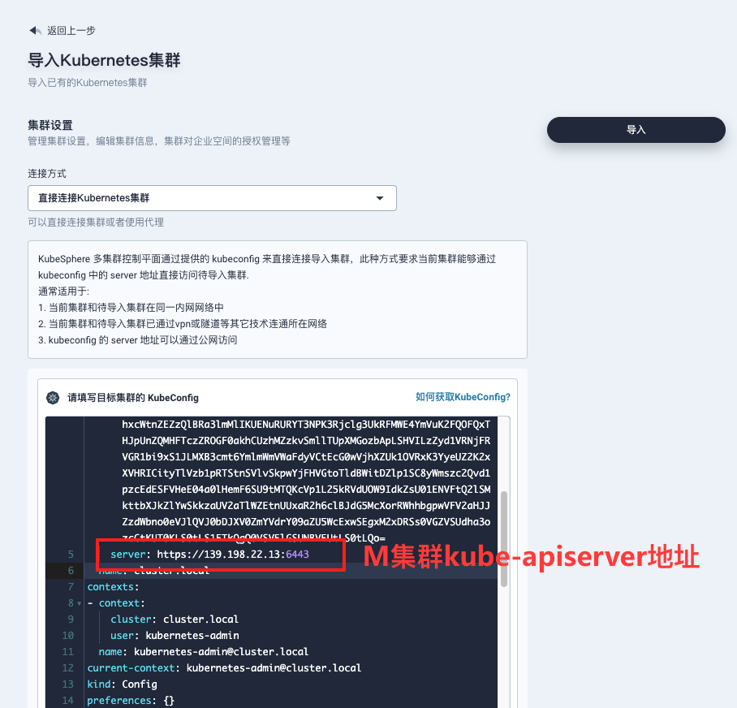
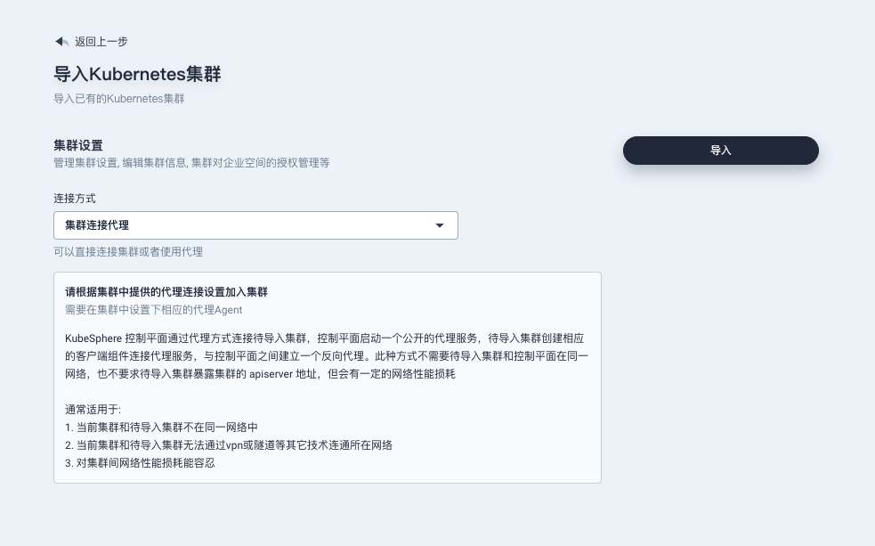
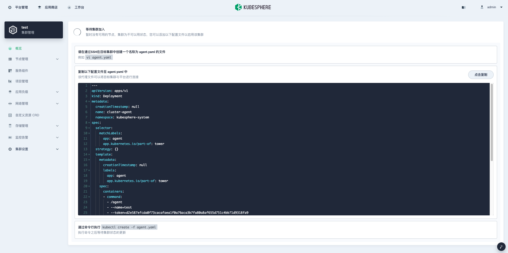

# 如何启用多集群

<!-- vscode-markdown-toc -->
* 1. [概述](#Intro)
* 2. [直接连接](#direct)
  * 2.1. [安装 Host Cluster 集群](#HostCluster)
  * 2.2. [安装 Member Cluster 集群](#MemberCluster)
  * 2.3. [导入集群](#AddCluster)
* 3. [代理连接](#agent)
  * 3.1. [安装 Host Cluster](#HostCluster-Agent)
  * 3.2. [安装 Member Cluster](#MemberCluster-Agent)
  * 3.3. [导入集群](#AddCluster-Agent)

<!-- vscode-markdown-toc-config
	numbering=true
	autoSave=true
	/vscode-markdown-toc-config -->
<!-- /vscode-markdown-toc -->

## 1. <a name='Intro'></a>概述

多集群功能涉及到多个集群之间的网络连通，了解集群之前的网络拓扑有助于减少接下来的工作量。

多集群功能需要创建一个 Host Cluster，实际即是一个开启了多集群功能的 KubeSphere 集群，简称 H 集群。H 集群管理的所有集群称之为 Member Cluster，即是一个普通的未开启多集群功能的 KubeSphere 集群，简称 M 集群。H 集群只能有一个，M 集群可以有多个。在多集群架构中，要求 H 集群和 M 集群网络可以直连或者通过代理连通，M 集群之间的网络可以是处在完全隔离的环境中。

## 2. <a name='direct'></a>直接连接

如果 M 集群 kube-apiserver 地址可以在 H 集群上的任一节点上都能访问，即可以使用直接连接的方式。直接连接方式适用于 M 集群可以暴露 kube-apiserver 地址或者 H 和 M 集群处在同一个私网环境中。

### 2.1. <a name='HostCluster'></a>安装 Host Cluster 集群

* 安装 Host Cluster 与安装 KubeSphere 没有大的区别，唯一的区别在于安装时确保 installer 的配置文件 ClusterConfiguration 中 multicluster 项如下配置。

    ```yaml
    multicluster:
      clusterRole: host
    ```

  如果你已经有一个安装好的 KubeSphere 集群，也可以通过修改 cluster configuration 的方式改变集群的角色，然后等待配置生效。

    ```shell
    kubectl edit cc ks-installer -n kubesphere-system
    ```

### 2.2. <a name='MemberCluster'></a>安装 Member Cluster 集群

* 安装 Member Cluster 和安装普通的未开启多集群功能的集群没有任何区别。确保安装时 installer 的 ClusterConfiguration 中 multicluster 项如下配置。

    ```yaml
    multicluster:
      clusterRole: member
    ```

* 同时为了能够使 host 集群直接管理 member 集群，需要将 member 集群的 jwtSecret 设置与 host 相同。 在 host 集群上执行下列命令获取到 host 集群的 jwtSecret
  ```
  ~$ kubectl -n kubesphere-system get cm kubesphere-config -o yaml | grep -v "apiVersion" | grep jwtSecret
      jwtSecret: "5qaMJf8i0YMBSETkcbmdhlAlpz8GF0n2tfzv0KbPi4kQjirzKjWdvEaAlcOiWnvPyilGIrR01XJW0oZUkQRfB9TXKCEQr6ORazz"
  ```
  在集群安装配置文件中，设置如下项，保持 jwtSecret 与 host 集群一致，
  ```
  authentication:
    jwtSecret: "5qaMJf8i0YMBSETkcbmdhlAlpz8GF0n2tfzv0KbPi4kQjirzKjWdvEaAlcOiWnvPyilGIrR01XJW0oZUkQRfB9TXKCEQr6ORazz"
  ```
  配置完成后，执行安装。

### 2.3. <a name='AddCluster'></a>导入集群

* 打开 H 集群 dashboard，点击添加集群，输入集群基本信息后点击下一步。

* 连接方式选择 `直接连接 KubeSphere 集群`， 将 Member 集群的 kubeconfig 内容粘贴到输入框中。确保 kubeconfig 中的 `server` 地址在 H 集群中的任一节点都可以访问。`KubeSphere API Server` 地址填写 KubeSphere APIServer 的地址，也可以不填。



* 点击导入，等待集群初始化完成即可

## 3. <a name='agent'></a>代理连接

代理连接使用了 KubeSphere 的 [Tower](https://github.com/kubesphere/tower) 组件，Tower 是一个可以在集群间通过代理方式创建网络连接的工具。如果 H 集群不能直接访问 M 集群，可以通过暴露 H 集群代理服务地址，M 集群通过代理来创建和 H 集群的网络连接。代理连接的方式适用于 M 集群处在非公开的 IDC 机房等私有环境，而 H 集群有能力暴露代理服务的场景。

### 3.1. <a name='HostCluster-Agent'></a>安装 Host Cluster

* 安装 Host Cluster 与安装 KubeSphere 没有大的区别，唯一的区别在于安装时确保 installer 的配置文件 ClusterConfiguration 中 multicluster 项如下配置 。

    ```yaml
    multicluster:
      clusterRole: host
    ```

  如果你已经有一个安装好的 KubeSphere 集群，也可以通过修改 cluster configuration 的方式改变集群的角色，然后等待配置生效。

    ```shell
    kubectl edit cc ks-installer -n kubesphere-system
    ```

* 设置代理服务地址

  Host Cluster 安装成功后，`kubesphere-system` 项目下会创建一个名称为 tower，type 为 LoadBalancer 的代理服务。

  1. 如果集群有可以使用的 LoadBalancer 插件，可以看到 `EXTERNAL-IP` 栏目有对应的地址显示，KubeSphere 会自动获取这个地址，我们可以跳过接下来的设置代理的步骤。

        ```shell
        $ kubectl -n kubesphere-system get svc
        NAME       TYPE            CLUSTER-IP      EXTERNAL-IP     PORT(S)              AGE
        tower      LoadBalancer    10.233.63.191   139.198.110.23  8080:30721/TCP       16h
        ```

  2. 如果一直没有对应的地址显示，则需要手动设置下代理地址。假设现在有可以对外的公网 IP 地址 139.198.120.120，已经通过端口转发的方式将此 IP 地址的 8080 端口转发到集群节点的 30721 端口 (请根据您具体的端口号转发)。

        ```shell
        $ kubectl -n kubesphere-system get svc
        NAME       TYPE            CLUSTER-IP      EXTERNAL-IP     PORT(S)              AGE
        tower      LoadBalancer    10.233.63.191   <pending>  8080:30721/TCP       16h
        ```

  3. 修改配置文件，填入之前设置的地址

        ```shell
        $ kubectl -n kubesphere-system edit clusterconfiguration ks-installer

        multicluster:
            clusterRole: host
            proxyPublishAddress: http://139.198.120.120:8080 # 增加这一行，设置 tower 服务的访问地址，填入上面设置的 IP 地址
        ```

  4. 保存设置，并且重启 ks-apiserver

        ```shell
        kubectl -n kubesphere-system rollout restart deployment ks-apiserver
        ```

### 3.2. <a name='MemberCluster-Agent'></a>安装 Member Cluster

* 安装 Member Cluster 和安装普通的未开启多集群功能的集群没有任何区别。确保安装时 installer 的 ClusterConfiguration 中 multicluster 项如下配置。

    ```yaml
    multicluster:
      clusterRole: member
    ```

* 同时为了能够使 host 集群直接管理 member 集群，需要将 member 集群的 jwtSecret 设置与 host 相同。 在 host 集群上执行下列命令获取到 host 集群的 jwtSecret
  ```
  ~$ kubectl -n kubesphere-system get cm kubesphere-config -o yaml | grep -v "apiVersion" | grep jwtSecret
      jwtSecret: "5qaMJf8i0YMBSETkcbmdhlAlpz8GF0n2tfzv0KbPi4kQjirzKjWdvEaAlcOiWnvPyilGIrR01XJW0oZUkQRfB9TXKCEQr6ORazz"
  ```
  在集群安装配置文件中，设置如下项，填入上一步中获取到的 host 集群的 jwtSecret ，
  ```
  authentication:
    jwtSecret: "5qaMJf8i0YMBSETkcbmdhlAlpz8GF0n2tfzv0KbPi4kQjirzKjWdvEaAlcOiWnvPyilGIrR01XJW0oZUkQRfB9TXKCEQr6ORazz"
  ```
  配置完成后，执行安装。


### 3.3. <a name='AddCluster-Agent'></a>导入集群

1. 打开 H 集群 dashboard，点击添加集群，输入集群基本信息后点击下一步。

2. 连接方式选择 `集群连接代理`，点击导入

   

3. 根据提示在 M 集群中，创建一个 `agent.yaml` 文件，并将生成的部署粘贴到文件中，在节点上执行 `kubectl create -f agent.yaml`，等待 agent 运行正常。确保 M 集群上可以访问 H 集群的代理地址。

   

4. 集群代理运行正常后即可在 H 集群上看到导入的集群
