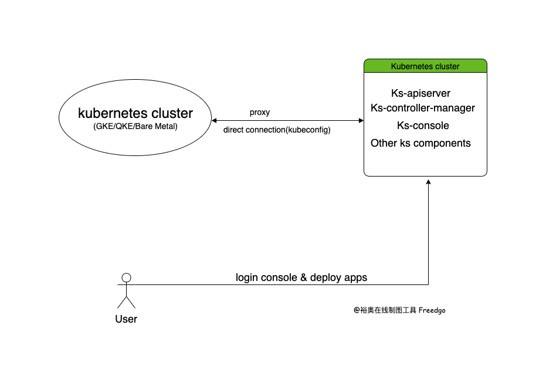

# Proposal for Standalone KubeSphere 

## Background

There are many KubeSphere users have difficulty on installing Kubesphere on their existing clusters. We need to provide the ability of installing KubeSphere out of user's Kubernetes cluster.

## Proposal

### User Stories

#### Story 1

As a user of KubeSphere, I can install KubeSphere by kubekey or ks-installer.

#### Story 2

As a user of KubeSphere, I can install KubeSphere out of the target cluster(e.g.virtual machine/another k8s cluster), which can be helpful to reduce the payload of the target cluster.

## Implementation

Install CRD and Custom Resource on user's cluster.
Run **ks-apiserver** and **ks-controller-manager** with `--kubeconfig` flag out of user's cluster.

Login **ks-console** and deploy workloads.

