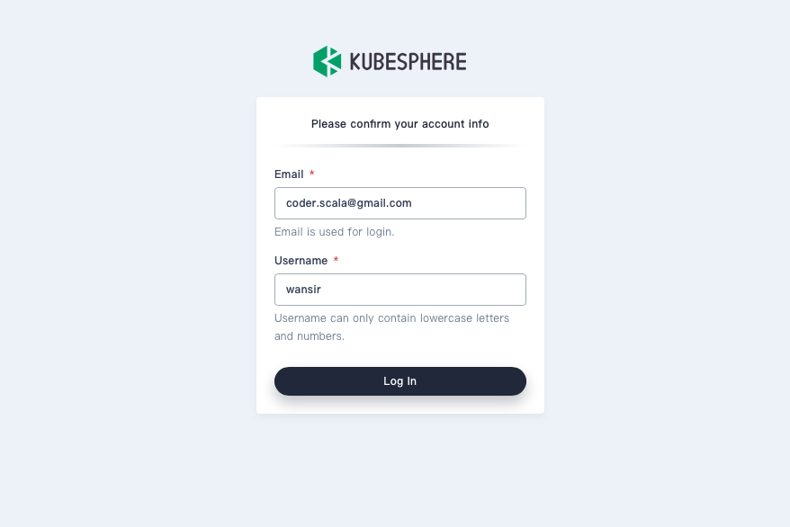

# How to configure authentication

## Overview

KubeSphere includes a built-in OAuth server. Users obtain OAuth access tokens to authenticate themselves to the API.

As an administrator, you can configure OAuth by editing configmap to specify an identity provider.

## Authentication Configuration

KubeSphere has an internal account management system. You can modify the kubesphere authentication configuration by the following command:

```bash
kubectl -n kubesphere-system edit cm kubesphere-config
```

Example Configuration:

```yaml
apiVersion: v1
data:
  kubesphere.yaml: |
    authentication:
      authenticateRateLimiterMaxTries: 10
      authenticateRateLimiterDuration: 10m0s
      loginHistoryRetentionPeriod: 7d
      maximumClockSkew: 10s
      multipleLogin: true
      jwtSecret: "************"
      oauthOptions:
        accessTokenMaxAge: 1h
        accessTokenInactivityTimeout: 30m
        identityProviders:
        - name: ldap
          type: LDAPIdentityProvider
          mappingMethod: auto
          provider:
          ...
kind: ConfigMap
name: kubesphere-config
namespace: kubesphere-system
```

For the above example:

| Parameter | Description |
|-----------|-------------|
| authenticateRateLimiterMaxTries | AuthenticateRateLimiter defines under which circumstances we will block user. |
| authenticateRateLimiterDuration | A user will be blocked if his/her failed login attempt reaches AuthenticateRateLimiterMaxTries in AuthenticateRateLimiterDuration for about AuthenticateRateLimiterDuration. |
| loginHistoryRetentionPeriod | Retention login history, records beyond this amount will be deleted. |
| maximumClockSkew |  Controls the maximum allowed clock skew when performing time-sensitive operations, such as validating the expiration time of a user token. The default value for maximum clock skew is `10 seconds`. |
| multipleLogin |  Allow multiple users login from different location at the same time. The default value for multiple login is `true`. |
| jwtSecret | Secret to sign user token. Multi-cluster environments need to use the same secret. |
| accessTokenMaxAge |  AccessTokenMaxAge control the lifetime of access tokens. The default lifetime is 2 hours. Setting the `accessTokenMaxAge` to 0 means the token will not expire, it will be set to 0 when the cluster role is member. |
| accessTokenInactivityTimeout | Inactivity timeout for tokens. The value represents the maximum amount of time that can occur between consecutive uses of the token. Tokens become invalid if they are not used within this temporal window. The user will need to acquire a new token to regain access once a token times out. |


After modifying the identity provider configuration, you need to restart the ks-apiserver.

```bash
kubectl -n kubesphere-system rollout restart deploy/ks-apiserver
```

## Identity Providers

You can define additional authentication configuration in the `identityProviders `section.

There are four parameters common to all identity providers:

| Parameter | Description |
|-----------|-------------|
| name | The unique name of the identity provider is associated with the user label. |
| mappingMethod | The account mapping configuration. You can use different mapping methods, such as:<br/>- `auto`: The default value. The user account will be automatically created and mapped if the login is successful. <br/>- `lookup`: Using this method requires you to manually provision accounts. |

### Supported Identity Providers

[LDAPIdentiyProvider](../ldap-identity-provider.md)

[GitHubIdentiyProvider](../github-identity-provider.md)

[OIDCIdentiyProvider](../github-identity-provider.md)

### Confirm Account Information

After the third-party account is mapped to KubeSphere, you need to confirm the account information to ensure that the email and username are in the correct format.


