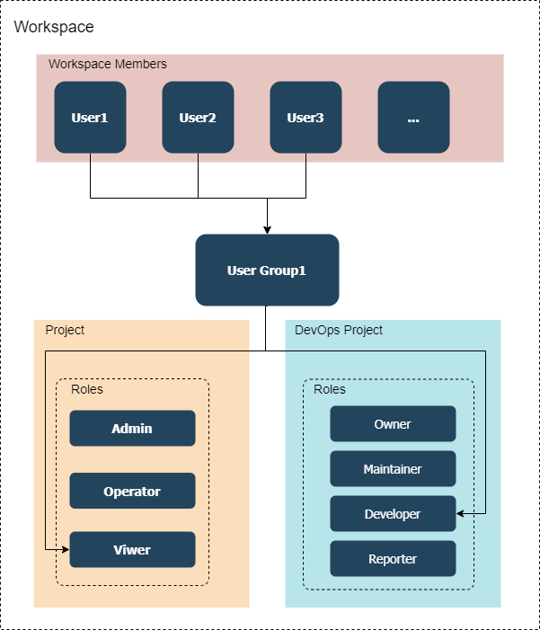
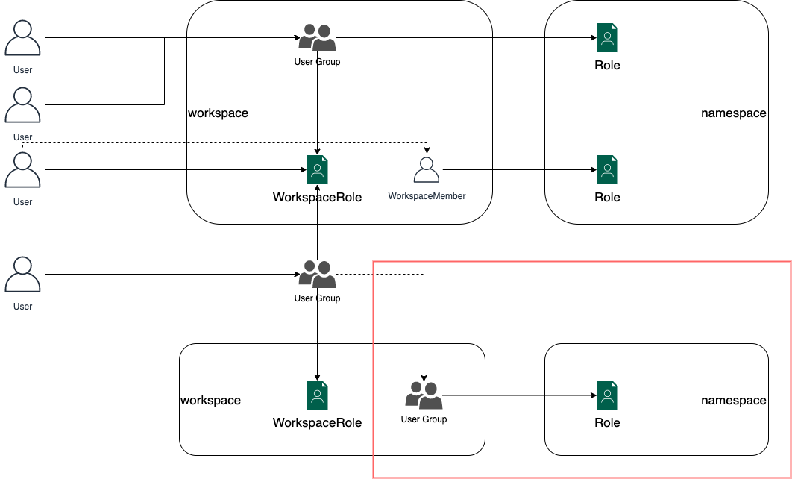

# User Group Design

## Objective

Kubesphere uses RBAC authorization to drive authorization decisions. But roles only can be assigned to individual users currently, which is inconvenient in some scenarios. For example, one team may need to manage multiple projects in a workspace, but we can only grant all projects permission with the role of workspace level, or we have to invite users to those projects one by one and grant with a role of project level.

By binding the project role to a Group, we can grant multiple projects' permission to the group then all the users in the group have access to those projects.

### User group management of platform level

At the platform level, the user group will be shown as a hierarchical structure of workspace and groups of the workspace. Admins will be able to assign users to a group.

> Note: Grant permission of the platform level won't be supported, since those permissions are privileged.

### User group management of workspace level 

At the workspace level, admins can grant permission to a group by binding roles to the group. Groups are isolated between workspaces since groups are the subresources of the workspace.

## Outline

1. Create groups in Workspace
2. Bind group with Project Role
3. Bind group with DevOps Project Role
4. Bind group with Workspace Role
5. Add members to the group in Workspace and Platform, grant permissions to a group in Workspace
6. Create hierarchical groups



## Authorization process

The Authorization process is shown below.



## Scenario

- case 1: Grant `user2`, `user3`, `user4` with `demo-project`, `demo4-project` Admin permisison
- case 2: Grant `user1`, `user2` with `demo-project\viewer`, `demo2-project\admin` permission

As scenarios described above, we can create the following User, Group, and Group-Role Bindings.

> Lines with Strike show the capability of the Group, which doesn't use in the case.

1. Groups
 - Group1
   - ~~Group Sub1~~
   - ~~Group Sub2~~
 - Group2
   - ~~Group Sub3~~
   - ~~Group Sub4~~

2. Group-Role Bindings
 - Group1 
   - demo-project\viewer
   - demo2-project\admin
 - Group2
   - demo-project\admin
   - demo4-project\admin
3. Group-User Bindings
 - Group1
   - user1
   - user2
 - Group2
   - user2
   - user3
   - user4


### Optional feature

we can support one the the following feature.

1. Inherit Permission: User in the subgroup will inherit all the permissions of the parent permission.
2. Limit Permission: Subgroup can be only granted with the permission of the parent. 

## Data Structure

The following CRDs will be created or used in the Group.

### Group

The Group defines the groups created by the user. And present the relations between groups.

```yaml
apiVersion: iam.kubesphere.io/v1alpha1
kind: Group
metadata:
  labels:
    iam.kubesphere.io/group-parent: group1
  name: group2
```

### GroupBinding

GroupBinding is used to present relations between Group and User.

```yaml
apiVersion: iam.kubesphere.io/v1alpha1
kind: GroupBinding
metadata:
  labels:
    iam.kubesphere.io/group-ref: group1
    iam.kubesphere.io/user-ref: user2
  name: groupbinding-sample1
subjectRef:
  apiGroup: rbac.authorization.k8s.io
  kind: User
  name: user2
groupRef:
  apiGroup: rbac.authorization.k8s.io
  kind: Group
  name: group1
```

### RoleBinding

RoleBinding is Kubernetes's internal Kind. Which is used to bind Role and Group.


