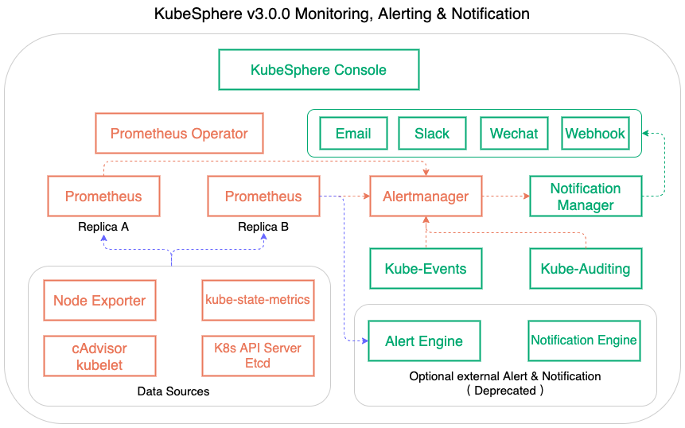

# KubeSphere Monitoring

## Overview

The KubeSphere monitoring system is comprised of many components that work together to achieve overall monitoring functionality. KubeSphere defaults to installing the monitoring module. It will deploy or create a few components within the namespace `kubesphere-monitoring-system`:

- Prometheus Operator: automates tasks for operating Prometheus instances.
- Prometheus: scrapes metrics and provides monitoring service.
- Kube-state-metrics: exposes metrics of kubernetes objects like deployment, pod, namespace, etc.
- Node-exporter: exposes node metrics.
- Alertmanager: manages alerts triggered by prometheus and other sources.
- Notification Manager: manages notifications in multi-tenant K8s environment in K8s native way. It receives alerts or notifications from different senders such as Alertmanager and then send notifications to various tenant receivers. 

Besides, the monitoring stack includes CRD resources:

- ServiceMonitor: declaratively specifies how groups of services should be monitored.
- Prometheus: defines a desired Prometheus statefulset.
- Thanos: defines a desired thanos sidecar and object storege spec.
- Thanos Ruler: defines a desired thanos ruler statefulset.
- PrometheusRule: defines a desired Prometheus rule file.

In KubeSphere, Prometheus will monitor the following services by default:

- kube-state-metrics
- node-exporter
- kubelet
- s2i-operator
- etcd
- coredns
- kube-apiserver
- kube-scheduler
- kube-controller-manager

## Setup

The [kube-prometheus](https://github.com/kubesphere/kube-prometheus/tree/ks-v3.0) folder provides manifests for setting up the monitoring stack. The [kubernetes-mixin](https://github.com/kubesphere/kubernetes-mixin/blob/ks-v3.0) project provides recording rule templates. KubeSphere monitoring backend serves as Prometheus client performing metrics query.

The diagram below presents the overall monitoring architecture:

