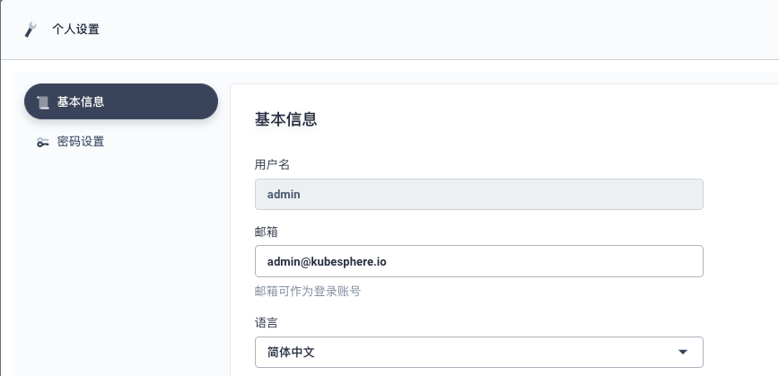
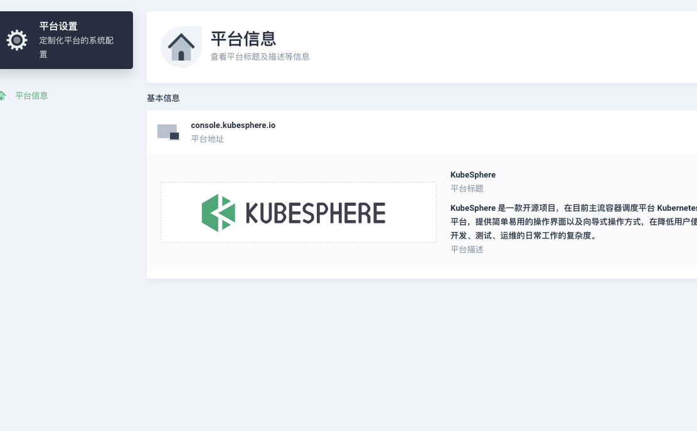

# Multi-Tenant Notification #

# Notification Manager
 Notification Manager manages notifications in a multi-tenant K8s environment. It receives alerts or notifications from different senders and then sends notifications to various tenant receivers based on alerts/notifications' tenant labels like "namespace". 

 Supported senders include:
- Prometheus Alertmanager
- Custom sender (Coming soon)

 Supported receivers include:
- Email
- [Wechat Work](https://work.weixin.qq.com/)
- Slack 
- Webhook
- DingTalk

## Architecture
 Notification Manager uses CRDs to store notification configs like email, wechat, and slack. It also includes an operator to create and reconcile NotificationManager CRD which watches all notification config CRDs, updates notification settings accordingly, and sends notifications to users.

 

## Integration with Alertmanager
 Notification Manager could receive webhook notifications from Alertmanager and then send notifications to users in a multi-tenancy way.

 

## CustomResourceDefinitions
 Notification Manager uses the following CRDs to define the desired alerts/notifications webhook and receiver configs:
- NotificationManager: Defines the desired alerts/notification webhook deployment. The Notification Manager Operator ensures a deployment meeting the resource requirements is running.
- EmailConfig: Defines the email configs like SmartHost, AuthUserName, AuthPassword, From, RequireTLS, etc. 
- EmailReceiver: Define the email receiver's mail addresses and the EmailConfig selector.
- WechatConfig: Define the wechat configs like ApiUrl, ApiCorpId, AgentId, and ApiSecret. 
- WechatReceiver: Define the wechat receiver related info like ToUser, ToParty, ToTag as well as WechatConfig Selector.
- SlackConfig: Define the slack configs like SlackTokenSecret.
- SlackReceiver: Define the slack channel to send notifications to and the SlackConfig selector.
- WebhookConfig: Define the webhook Url, HttpConfig.
- WebhookReceiver: Define the WebhookConfig selector.

 The relationship between receivers and configs can be demonstrated as below:

 

 Receiver CRDs like EmailReceiver, WechatReceiver, SlackReceiver and WebhookReceiver can be categorized into 2 types `global` and `tenant` by label like `type = global`, `type = tenant` :
- A global EmailReceiver receives all alerts and then sends notifications regardless tenant info(user or namespace).
- A tenant EmailReceiver receives alerts with specified tenant labels like `user` or `namespace`

 Usually alerts received from Alertmanager contains a `namespace` label, Notification Manager uses this label to decide which receiver to use for sending notifications:
- For KubeSphere, Notification Manager will try to find workspace `user` in that `namespace`'s rolebinding and then find receivers with `user = xxx` label.
- For other Kubernetes cluster, Notification Manager will try to find receivers with `namespace = xxx` label. 

 For alerts without a `namespace` label, for example, alerts of node or kubelet, user can setup a receiver with `type = global` label to receive alerts without a `namespace` label. A global receiver sends notifications for all alerts received regardless any label. A global receiver is usually set for an admin role.

 Config CRDs like EmailConfig, WechatConfig, SlackConfig, WebhookConfig can be categorized into 2 types `tenant` and `default` by label like `type = tenant`, `type = default`:
- Tenant EmailConfig is to be selected by a tenant EmailReceiver which means each tenant can have his own EmailConfig. 
- If no EmailConfig selector is configured in an EmailReceiver, then this EmailReceiver will try to find a `default` EmailConfig. Usually, the admin will set a global default config.

 A receiver could be configured without xxxConfigSelector, in which case Notification Manager will try to find a default xxxConfigSelector with `type = default` label, for example:
- A global EmailReceiver with `type = global` label should always use the default EmailConfig which means emailConfigSelector needn't be configured for a global EmailReceiver and one default EmailConfig with `type = default` label needs to be configured for all global EmailReceivers.  
- Usually a tenant EmailReceiver with `type = tenant` label could have its own tenant emailConfigSelector to find its tenant EmailConfig with `type = tenant` label.
- A tenant EmailReceiver with `type = tenant` label can also be configured without an emailConfigSelector, in which case Notification Manager will try to find the default EmailConfig with `type = default` label for this tenant EmailReceiver.


## Requirements ##

- Every user can customize the channels for receiving notifications, including email, wechat, slack, webhook and dingtalk, by customizing his own receivers and configs.



- The platform administrator can customize the global channels for receiving all notifications by customizing the global receivers and the default config. Only one default config is allowed for each type.



- The receiver of user will use the default config if his own config is not set.
- All receivers and configs are in the namespace `kubesphere-monitoring-system`.
- Before deleting the user, it should get all the receivers and configs of the user, and delete them.

## Parameters
### Parameters of Email Config

 parameter            | description | description
 ---                  | ---         | ---
 SMTP Server Address  | The smtp server host and port | required
 SMTP User            | The smtp user | required
 SMTP Password        | Password of smtp user, select form secret | required
 Sender Email Address | The email address of sender | required
 Use SSL              | Enable SSL secure connection | optional            

### Parameters of Email Receiver

 parameter               | description | description
 ---                     | ---         | ---
 Receiver Email Address  | The email address of the receiver can add multiple | required
 Email Config            | Email config which created by the current user or default email config | optional  

### Parameters of Wechat Config

 parameter     | description | description
 ---           | ---         | ---
 Company ID    | Company ID | required
 Agent ID      | The ID of app | required
 Secret        | The secret of app, select form secret | required

### Parameters of Wechat Receiver

 parameter     | description | description
 ---           | ---         | ---
 Users         | The user who receiver message,  can add multiple | optional     
 Parts         | If the user is in one of these parts, he will receive messages, can add multiple | optional     
 Tags          | If the user has one of these tags, he will receive messages, can add multiple | optional     
 Wechat Config | Wechat config which created by the current user or default Wechat config | optional     

 > One of the Users, Parts, Tags must be set.

### Parameters of Slack Config

 parameter     | description | description
 ---           | ---         | ---
 Slack Token   | The token of slack app, select form secret | required

### Parameters of Slack Receiver

 parameter     | description | description
 ---           | ---         | ---
 Channel       | The channel which will receive message | required
 Slack Config  | Slack config which created by the current user or default Slack config | optional   

### Parameters of Webhook Config

 parameter     | description | description
 ---           | ---         | ---
 Webhook URL   | The URL which the message will send to | optional
 Service       | The service which the message will send to, include service name, namespace, port, path, and scheme | optional
 Http Config   | The configuration of Webhook | optional   

 > One of the Webhook URL and Service must be set.

 Parameters of Http Config

 parameter     | description | description
 ---           | ---         | ---
 BasicAuth     | The HTTP basic authentication credentials for the targets, include user and password, the password should be selected from secret | optional
 BearerToken   | The bearer token for the targets, select from secret | optional
 Proxy URL     | HTTP proxy server to use to connect to the targets | optional
 TLS Config    | Options for TLS connections | optional

 Parameters of TLS Config

 parameter          | description | description
 ---                | ---         | ---
 InsecureSkipVerify | Disable target certificate validation, if true, the ca, cert and key should not be set | optional
 Root CA            | The root CA cert to use for the targets, select from secret. If the InsecureSkipVerify is false, Root CA must be set | optional
 Client Cert        | The client cert file for the targets, select from secret. Cert and Key should be set together. If the cert is set, the root ca must be set | optional
 Client key         | The client key file for the targets, select from secret. Cert and Key should be set together. If the key is set, the root ca must be set | optional


### Parameters of Webhook Receiver

 parameter          | description | description
 ---                | ---         | ---
 Webhook Config     | Webhook config which created by current user or default Webhook config|optional

### Parameters of DingTalk Config

 parameter          | description | description
 ---                | ---         | ---
 ChatBot            | The configuration of the DingTalk ChatBot, messages will send to the ChatBot | optional
 Conversation       | The configuration of the DingTalk conversation, messages will send to the conversation |optional

 > The ChatBot and Conversation can be set together, the message will send to the ChatBot and conversation both.

 Parameters of Http ChatBot

 parameter          | description | description
 ---                | ---         | ---
 Webhook            | The webhook that the message will send to, selected from secret | required
 Keywords           | The Keywords of the ChatBot, at most 10. The message send to ChatBot must include at least one of the Keywords | optional
 Secret             | The secret of the ChatBot which used to calculate the sign, selected from secret | optional

 Parameters of Http Conversation

 parameter          | description | description
 ---                | ---         | ---
 AppKey             | The key of the DingTalk app, used to get the token, selected from secret | required
 AppSecret          | The secret of the DingTalk app, used to get the token, selected from secret | required
 Chat ID            | The conversation id which the message will send to | required

### Parameters of DingTalk Receiver

 parameter          | description | description
 ---                | ---         | ---
 DingTalk Config    | DingTalk config which created by current user or default DingTalk config | optional

## API ##

### Secret API
#### Create Secret

 > POST /kapis/notification.kubesphere.io/v2alpha1/secrets

 Request body
```
apiVersion: v1
data:
  password: THdq
kind: Secret
metadata:
  labels:
    app: notification-manager
  name: test-user-email-secret
type: Opaque
```

 Response body

```
apiVersion: v1
data:
  password: THdq
kind: Secret
metadata:
  annotations:
    kubectl.kubernetes.io/last-applied-configuration: |
      {"apiVersion":"v1","data":{"password":"THdq"},"kind":"Secret","metadata":{"annotations":{},"labels":{"app":"notification-manager"},"name":"test-user-email-secret","namespace":"kubesphere-monitoring-system"},"type":"Opaque"}
  creationTimestamp: "2020-09-27T06:22:35Z"
  labels:
    app: notification-manager
  name: test-user-email-secret
  namespace: kubesphere-monitoring-system
  resourceVersion: "2120290"
  selfLink: /api/v1/namespaces/kubesphere-monitoring-system/secrets/test-user-email-secret
  uid: ff6c0bfe-b01c-49be-93eb-42d5e6042824
type: Opaque
```

#### Update Secret

 > PUT /kapis/notification.kubesphere.io/v2alpha1/secrets/{secret}

#### Delete Secret

 > DELETE /kapis/notification.kubesphere.io/v2alpha1/secrets/{secret}

#### Get Secret

 > GET /kapis/notification.kubesphere.io/v2alpha1/secrets/{secret}

#### List Secret

 > DELETE /kapis/notification.kubesphere.io/v2alpha1/secrets

### Email API
#### Create Email Config

 > POST /kapis/notification.kubesphere.io/v2alpha1/emailconfigs

 Request body

```
apiVersion: notification.kubesphere.io/v1alpha1
kind: EmailConfig
metadata:
  labels:
    app: notification-manager
    type: tenant
    user: test-user
  name: test-user-config
spec:
  authPassword:
    key: password
    name: test-user-email-secret
  authUsername: abc
  from: abc@yunify.com
  requireTLS: true
  smartHost:
    host: imap.yunify.com
    port: "25"
```

 Response Body

```
apiVersion: notification.kubesphere.io/v1alpha1
kind: EmailConfig
metadata:
  annotations:
    kubectl.kubernetes.io/last-applied-configuration: |
      {"apiVersion":"notification.kubesphere.io/v1alpha1","kind":"EmailConfig","metadata":{"annotations":{},"labels":{"app":"notification-manager","type":"tenant","user":"test-user"},"name":"test-user-config","namespace":"kubesphere-monitoring-system"},"spec":{"authPassword":{"key":"password","name":"test-user-email-secret"},"authUsername":"wanjunlei","from":"wanjunlei@yunify.com","requireTLS":true,"smartHost":{"host":"imap.yunify.com","port":"25"}}}
  creationTimestamp: "2020-09-27T06:22:35Z"
  generation: 1
  labels:
    app: notification-manager
    type: tenant
    user: test-user
  name: test-user-config
  namespace: kubesphere-monitoring-system
  resourceVersion: "2120291"
  selfLink: /apis/notification.kubesphere.io/v1alpha1/namespaces/kubesphere-monitoring-system/emailconfigs/test-user-config
  uid: ab567b84-f8b7-42c5-a676-fe4f3e3b8b48
spec:
  authPassword:
    key: password
    name: test-user-email-secret
  authUsername: abc
  from: abc@yunify.com
  requireTLS: true
  smartHost:
    host: imap.yunify.com
    port: "25"
```

#### Update Email Config

 > PUT /kapis/notification.kubesphere.io/v2alpha1/emailconfigs/{emailconfig}

#### Delete Email Config

 > DELETE /kapis/notification.kubesphere.io/v2alpha1/emailconfigs/{emailconfig}

#### Get Email Config

 > GET /kapis/notification.kubesphere.io/v2alpha1/emailconfigs/{emailconfig}

#### List Email Config

 > DELETE /kapis/notification.kubesphere.io/v2alpha1/emailconfigs

#### Create Email Receiver

 > POST /kapis/notification.kubesphere.io/v2alpha1/emailreceivers

#### Update Email Receiver

 > PUT /kapis/notification.kubesphere.io/v2alpha1/emailreceivers/{emailreceiver}

#### Delete Email Receiver

 > DELETE /kapis/notification.kubesphere.io/v2alpha1/emailreceivers/{emailreceiver}

#### Get Email Receiver

 > GET /kapis/notification.kubesphere.io/v2alpha1/emailreceivers/{emailreceiver}

#### List Email Receiver

 > DELETE /kapis/notification.kubesphere.io/v2alpha1/emailreceivers

### Wechat API
#### Create Wechat Config

 > POST /kapis/notification.kubesphere.io/v2alpha1/wechatconfigs

#### Update Wechat Config

 > PUT /kapis/notification.kubesphere.io/v2alpha1/wechatconfigs/{wechatconfig}

#### Delete Wechat Config

 > DELETE /kapis/notification.kubesphere.io/v2alpha1/wechatconfigs/{wechatconfig}

#### Get Wechat Config

 > GET /kapis/notification.kubesphere.io/v2alpha1/wechatconfigs/{wechatconfig}

#### List Wechat Config

 > DELETE /kapis/notification.kubesphere.io/v2alpha1/wechatconfigs

#### Create Wechat Receiver

 > POST /kapis/notification.kubesphere.io/v2alpha1/wechatreceivers

#### Update Wechat Receiver

 > PUT /kapis/notification.kubesphere.io/v2alpha1/wechatreceivers/{wechatreceiver}

#### Delete Wechat Receiver

 > DELETE /kapis/notification.kubesphere.io/v2alpha1/wechatreceivers/{wechatreceiver}

#### Get Wechat Receiver

 > GET /kapis/notification.kubesphere.io/v2alpha1/wechatreceivers/{wechatreceiver}

#### List Wechat Receiver

 > DELETE /kapis/notification.kubesphere.io/v2alpha1/wechatreceivers

### Slack API
#### Create Slack Config

 > POST /kapis/notification.kubesphere.io/v2alpha1/slackconfigs

#### Update Slack Config

 > PUT /kapis/notification.kubesphere.io/v2alpha1/slackconfigs/{slackconfig}

#### Delete Slack Config

 > DELETE /kapis/notification.kubesphere.io/v2alpha1/slackconfigs/{slackconfig}

#### Get Slack Config

 > GET /kapis/notification.kubesphere.io/v2alpha1/slackconfigs/{slackconfig}

#### List Slack Config

 > DELETE /kapis/notification.kubesphere.io/v2alpha1/slackconfigs

#### Create Slack Receiver

 > POST /kapis/notification.kubesphere.io/v2alpha1/slackreceivers

#### Update Slack Receiver

 > PUT /kapis/notification.kubesphere.io/v2alpha1/slackreceivers/{slackreceiver}

#### Delete Slack Receiver

 > DELETE /kapis/notification.kubesphere.io/v2alpha1/slackreceivers/{slackreceiver}

#### Get Slack Receiver

 > GET /kapis/notification.kubesphere.io/v2alpha1/slackreceivers/{slackreceiver}

#### List Slack Receiver

 > DELETE /kapis/notification.kubesphere.io/v2alpha1/slackreceivers

### Webhook API
#### Create Webhook Config

 > POST /kapis/notification.kubesphere.io/v2alpha1/webhookconfigs

#### Update Webhook Config

 > PUT /kapis/notification.kubesphere.io/v2alpha1/webhookconfigs/{webhookconfig}

#### Delete Webhook Config

 > DELETE /kapis/notification.kubesphere.io/v2alpha1/webhookconfigs/{webhookconfig}

#### Get Webhook Config

 > GET /kapis/notification.kubesphere.io/v2alpha1/webhookconfigs/{webhookconfig}

#### List Webhook Config

 > DELETE /kapis/notification.kubesphere.io/v2alpha1/webhookconfigs

#### Create Webhook Receiver

 > POST /kapis/notification.kubesphere.io/v2alpha1/webhookreceivers

#### Update Webhook Receiver

 > PUT /kapis/notification.kubesphere.io/v2alpha1/webhookreceivers/{webhookreceiver}

#### Delete Webhook Receiver

 > DELETE /kapis/notification.kubesphere.io/v2alpha1/webhookreceivers/{webhookreceiver}

#### Get Webhook Receiver

 > GET /kapis/notification.kubesphere.io/v2alpha1/webhookreceivers/{webhookreceiver}

#### List Webhook Receiver

 > DELETE /kapis/notification.kubesphere.io/v2alpha1/webhookreceivers

### DingTalk API
#### Create DingTalk Config

 > POST /kapis/notification.kubesphere.io/v2alpha1/dingtalkconfigs

#### Update DingTalk Config

 > PUT /kapis/notification.kubesphere.io/v2alpha1/dingtalkconfigs/{dingtalkconfig}

#### Delete DingTalk Config

 > DELETE /kapis/notification.kubesphere.io/v2alpha1/dingtalkconfigs/{dingtalkconfig}

#### Get DingTalk Config

 > GET /kapis/notification.kubesphere.io/v2alpha1/dingtalkconfigs/{dingtalkconfig}

#### List DingTalk Config

 > DELETE /kapis/notification.kubesphere.io/v2alpha1/dingtalkconfigs

#### Create DingTalk Receiver

 > POST /kapis/notification.kubesphere.io/v2alpha1/dingtalkreceivers

#### Update DingTalk Receiver

 > PUT /kapis/notification.kubesphere.io/v2alpha1/dingtalkreceivers/{dingtalkreceiver}

#### Delete DingTalk Receiver

 > DELETE /kapis/notification.kubesphere.io/v2alpha1/dingtalkreceivers/{dingtalkreceiver}

#### Get DingTalk Receiver

 > GET /kapis/notification.kubesphere.io/v2alpha1/dingtalkreceivers/{dingtalkreceiver}

#### List DingTalk Receiver

 > DELETE /kapis/notification.kubesphere.io/v2alpha1/dingtalkreceivers