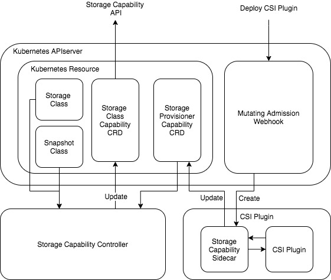

# Storage Capability Interface

This article outlines a plan for providing a unified interface to retrieve storage class capabilities.

## Motivation

Currently, more and more storage plugins are used in Kubernetes. On the one hand, storage providers who already have in-tree storage plugin need to develop their CSI plugin because Kubernetes community plans to migrate in-tree storage plugins to CSI. On the other hand, other storage providers could enable users to use their storage resources by their CSI plugins.

Since the CSI standard goes into GA in Kubernetes v1.13, plenty of storage features are introduced into Kubernetes, such as snapshot management, volume cloning and monitoring. Storage plugin developers could implement those features as needed. However, it is hard for users to understand the functional difference between different storage plugins.

In order to avoid confusion we need to forbid illegal operations in KubeSphere console when people are using storage features by providing an interface to describe capabilities of storage class.

## Architecture Graph

## Design

Storage capability contains Kubernetes original storage capability and CSI plugin capability.

Kubernetes original storage capability can be retrieved from the object of storage class and snapshot class. For example, cluster administrator may forbid users to expand volumes by setting the value of `allowVolumeExpansion` in storage class to false.

For CSI plugin capability, we can develop a sidecar container to obtain it through CSI identity server interface. We can get CSI plugin's metadata information and implemented features.

Two Kubernetes CRDs, Storage Provisioner Capability CRD and Storage Class Capability CRD, are developed. Storage Provisioner Capability CRD is aimed to store CSI plugin capabilities. Storage Class Capability CRD is used to describe the full capabilities of a storage class.

We also need to develop two execution programs, storage capability sidecar and storage capability controller. When CSI plugin deployed in Kubernetes, storage capability sidecar container will be created automatically through Mutating Admission Webhook. It will get CSI plugin information and update Storage Provisioner Capability CRD. Storage capability controller is responsible for retrieving Kubernetes original storage capability and updating Storage Class Capability CRD.
