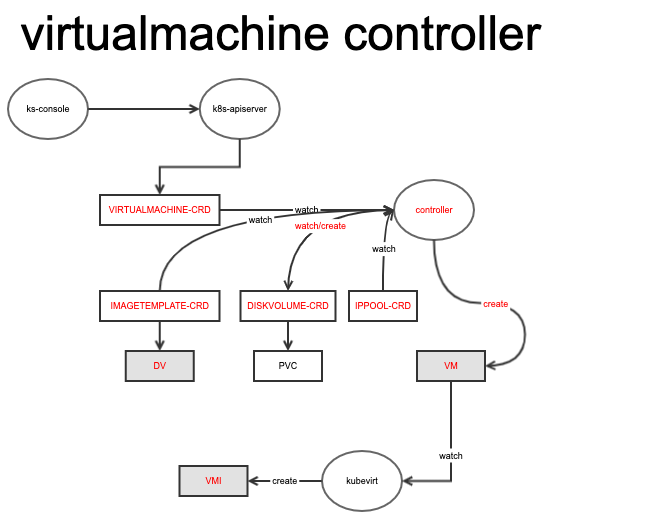
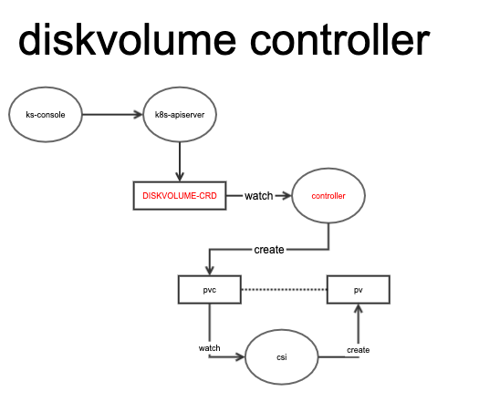
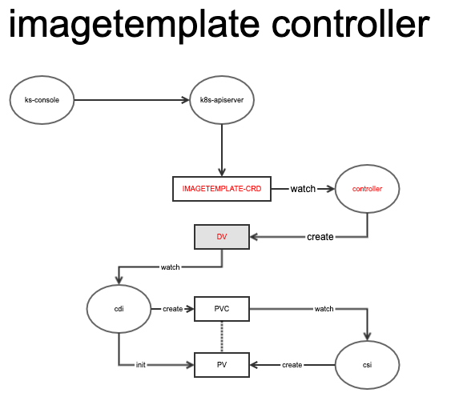

KubeSphere & KubeVirt Integration

# Summary

This proposal describes KubeVirt integration with KubeSphere. The aim is to add KubeVirt support to enable virtual machine management. 

KubeSphere will use our own CRDs, VirtualMachine, DiskVolume and ImageTemplate to manage VM instead of using KubeVirt's CRDs directly. This design is mainly based on the following reasons:
- KubeVirt is not yet GA, and we use a upper layer to isolate the bottom layer's changes;
- KubeSphere hopes to operate VM resources more easily, such as disk creation, image conversion, etc.;
- In some scenarios, KubeSphere wants to control the IP/MAC allocation of VMs, so a ippool filed is needed in VM's CRD.

Here will first introduce the architecture of KubeVirt, and then introduce the way kubesphere integrates with it.

# E1. KubeVirt

## VirtualMachine 

In terms of VM management, KubeVirt implements VM scheduling through virt-controller/virt-api/virt-handler/virt-launcher components, and VM control is implemented through the CRD of VirtualMachine.


## Disk and Image

For image and disk management, the bottom layer of KubeVirt relies on PVC and StorageClass plugins of kubernetes, and related resources managed by CDI components through the CRD of DataVolume.


## network

On the network, KubeVirt relies on multus to realize the management of VM multi-network cards. It provides four kinds of BindMechanism: bridge, Masquerade, Slirp, and Macvtap.


## Insufficient

- In some traditional scenarios, we will consider the hot migration of VMs and the fixation of IP/MAC. At this time, an additional controller is needed to generate the corresponding IP/MAC for the VM;
- There are some abuses in the use of CDI, such as importing DataVolume directly through VM's  dataVolumeTemplates, which will cause VM creation to be very slow.

# E2. kubesphere Integration

KubeSphere defines three CRDs which is VirtualMachine, DiskVolume and ImageTemplate to manage VM instead of using KubeVirt's CRDs directly. 

## E2.1. VirtualMachine

VirtualMachine: Used to describe the vm configuration, including diskVolumeTemplates, ippool, and Hardware.

### E2.1.1. CRD example

```
apiVersion: virtualmachine.kubesphere.io/v1alpha1
kind: VirtualMachine
metadata:
  name: vm1
  namespace: test2
spec:
  ippool: "p1"
  hardware:
      hostname: vm-test
      domain:
        cpu:
          cores: 2
          threads: 1
          sockets: 1
          model: Westmere
        devices:
          disks:
          - disk:
              bus: virtio
            name: disk0-vm-blank
          - disk:
              bus: virtio
            name: disk1
            bootOrder: 1
          - disk:
              bus: virtio
            name: cloudinitdisk
          interfaces:
            - macvtap: {}
              model: e1000
              name: eth0
          rng: {}
        machine:
          type: ""
        resources:
          requests:
            memory: 1024
      volumes:
      - name: disk1
        persistentVolumeClaim:
          claimName: disk1-from-image
      - cloudInitNoCloud:
          userData: |
            #cloud-config
            chpasswd: { "list": "root:kubeSphere", expire: False }
            ssh_pwauth: True
            disable_root: false
            runcmd:
              - ip a add 11.0.0.6/24 dev eth1
              - ip l set dev eth1 up
            ssh_authorized_keys:
            - ssh-rsa AAAAB3NzaC1yc2EAAAADAQABAAABAQDJq4iSlCQEn9S53OcJ2yvqyfcuoEHwWZCpvy2Fs3DOxxPp1tkNWvAA0jnfgQ8xDievISGE6cn5KgmfGk1JHZyDVZQ4Rv9XYXnw3z2wvyeUjIDH813nYPgEBfUX7NZGjY/4RxikggDBOau1UoOSVsgLRygp2/9WU20XEFqkXwgrUahgTPq47/XmiqlgmD9fesTDI/TK0DW26e+zH/533KKC0SImIf/ieDcHTLoiJFVLh9i3lsYJiP3RjcLEfBVGdit8tPEo1lOkLwLSuSQ2juSEKjiiDDB9qTYFfeG5xJ037T8RZzkICQNQiBwVXGU+F8HyKqGttaqi9AO2YTa9X root@i-myi8en26
        name: cloudinitdisk
  diskVolumeTemplates:
    - metadata:
        name: disk0-vm-blank
      spec:
        resources:
          requests:
            storage: 4Gi
        source:
          blank: {}
```

### E2.1.2. controller



## E2.2. DiskVolume

DiskVolume: Used to describe the disk, mainly including VolumeSource, Requests, StorageClassName. There are currently three forms: snap (create a disk through a snapshot), blank (create an empty disk), image (create a disk through image).


### E2.2.1. CRD example

```
apiVersion: diskvolume.kubesphere.io/v1alpha1
kind: DiskVolume
metadata:
  name: disk1
  namespace: test
spec:
  source:
    image:
      name: centos
      namespace: test
  resources:
    requests:
      storage: 4Gi
  storageClassName: sc
```

## E2.2.2. controller



## E2.3. ImageTemplate

ImageTemplate: Used to create image templates, mainly including Source, Requests, StorageClassName, source currently has four forms: HTTP (http download), Disk (VM's disk), Clone (existing image conversion), Registry (docker repo).

### E2.3.1 CRD example

```
apiVersion: virtualmachine.kubesphere.io/v1alpha1
kind: ImageTemplate
metadata:
  name: image-centos-http
  namespace: test2
  labels:
    virtualmachine.kubesphere.io/os-platform: "linux"
    virtualmachine.kubesphere.io/os-family: "centos"
    virtualmachine.kubesphere.io/os-version: "7.5_x86_64"
    virtualmachine.kubesphere.io/image-public: "yes"
    virtualmachine.kubesphere.io/image-source-key: "url"
    virtualmachine.kubesphere.io/image-source-value: "xxxx"
spec:
  source:
    clone:
      name: centos
      namespace: test
  resources:
    requests:
      storage: 8Gi
  storageClassName: sc
```

### E2.3.2 controller

