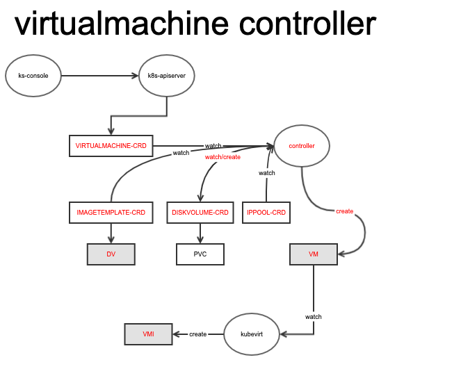
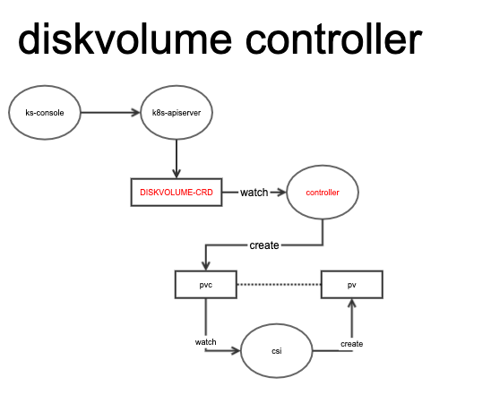
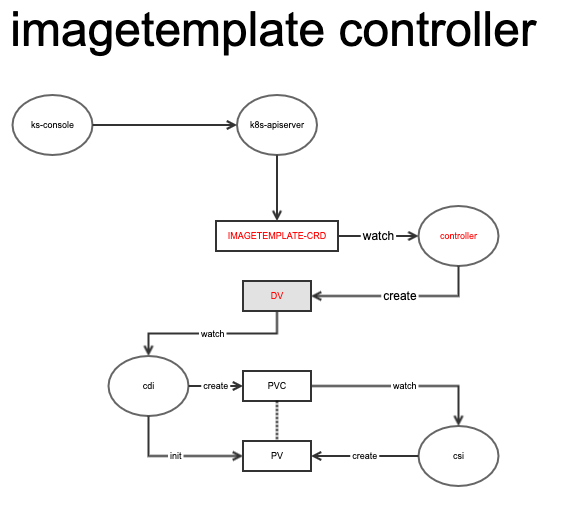

KubeSphere & KubeVirt Integration

# Summary

This proposal describes KubeVirt integration with KubeSphere. The aim is to add KubeVirt support to enable virtual machine management. 

KubeSphere will use our own CRDs, Virtualachine,DiskVolume and ImageTemplate to manage V instead of using KubeVirt's CRDs directly. This design is mainly based on the following reasons:
- KubeVirt is not yet GA, and we use a upper layer to isolate the bottom layer's changes;
- KubeSphere hopes to operate V resources more easily, such as disk creation, image conversion, etc;
- In some scenarios, KubeSphere wants to control the IP/AC allocation of Vs, so a ippool filed is needed in V's CRD.

The following will describe the three CRD resources, Virtualachine/DiskVolume/ImageTemplate and introduce internal logic of controller.

# E1. Virtualachine

Used to describe the vm configuration, including diskVolumeTemplates, ippool, and Hardware.

## CRD example

```
apiVersion: virtualmachine.kubesphere.io/v1alpha1
kind: Virtualachine
metadata:
  name: vm1
  namespace: test2
spec:
  ippool: "p1"
  hardware:
      hostname: vm-test
      domain:
        cpu:
          cores: 2
          threads: 1
          sockets: 1
          model: Westmere
        devices:
          disks:
          - disk:
              bus: virtio
            name: disk0-vm-blank
          - disk:
              bus: virtio
            name: disk1
            bootOrder: 1
          - disk:
              bus: virtio
            name: cloudinitdisk
          interfaces:
            - macvtap: {}
              model: e1000
              name: eth0
          rng: {}
        machine:
          type: ""
        resources:
          requests:
            memory: 1024
      volumes:
      - name: disk1
        persistentVolumeClaim:
          claimName: disk1-from-image
      - cloudInitNoCloud:
          userData: |
            #cloud-config
            chpasswd: { "list": "root:kubeSphere", expire: False }
            ssh_pwauth: True
            disable_root: false
            runcmd:
              - ip a add 11.0.0.6/24 dev eth1
              - ip l set dev eth1 up
            ssh_authorized_keys:
            - ssh-rsa AAAAB3NzaC1yc2EAAAADAQABAAABAQDJq4iSlCQEn9S53OcJ2yvqyfcuoEHwWZCpvy2Fs3DOxxPp1tkNWvAA0jnfgQ8xDievISGE6cn5KgmfGk1JHZyDVZQ4Rv9XYXnw3z2wvyeUjIDH813nYPgEBfUX7NZGjY/4RxikggDBOau1UoOSVsgLRygp2/9WU20XEFqkXwgrUahgTPq47/XmiqlgmD9fesTDI/TK0DW26e+zH/533KKC0SImIf/ieDcHTLoiJFVLh9i3lsYJiP3RjcLEfBVGdit8tPEo1lOkLwLSuSQ2juSEKjiiDDB9qTYFfeG5xJ037T8RZzkICQNQiBwVXGU+F8HyKqGttaqi9AO2YTa9X root@i-myi8en26
        name: cloudinitdisk
  diskVolumeTemplates:
    - metadata:
        name: disk0-vm-blank
      spec:
        resources:
          requests:
            storage: 4Gi
        source:
          blank: {}
```

## controller



# E2. DiskVolume

DiskVolume: Used to describe the disk, mainly including VolumeSource, Requests, StorageClassName. There are currently three forms: snap (create a disk through a snapshot), blank (create an empty disk), image (create a disk through a good image).


## CRD example

```
apiVersion: diskvolume.kubesphere.io/v1alpha1
kind: DiskVolume
metadata:
  name: disk1
  namespace: test
spec:
  source:
    image:
      name: centos
      namespace: test
  resources:
    requests:
      storage: 4Gi
  storageClassName: sc
```

## controller



# E3. ImageTemplate

ImageTemplate: Used to create image templates, mainly including Source, Requests, StorageClassName, source currently has four forms: HTTP (http download), Disk (V disk is replaced with a mirror), Clone (existing mirror conversion), Registry ( docker repo).

## CRD example
```
apiVersion: virtualmachine.kubesphere.io/v1alpha1
kind: ImageTemplate
metadata:
  name: image-centos-http
  namespace: test2
  labels:
    virtualmachine.kubesphere.io/os-platform: "linux"
    virtualmachine.kubesphere.io/os-family: "centos"
    virtualmachine.kubesphere.io/os-version: "7.5_x86_64"
    virtualmachine.kubesphere.io/image-public: "yes"
    virtualmachine.kubesphere.io/image-source-key: "url"
    virtualmachine.kubesphere.io/image-source-value: "xxxx"
spec:
  source:
    clone:
      name: centos
      namespace: test
  resources:
    requests:
      storage: 8Gi
  storageClassName: sc
```

## controller

