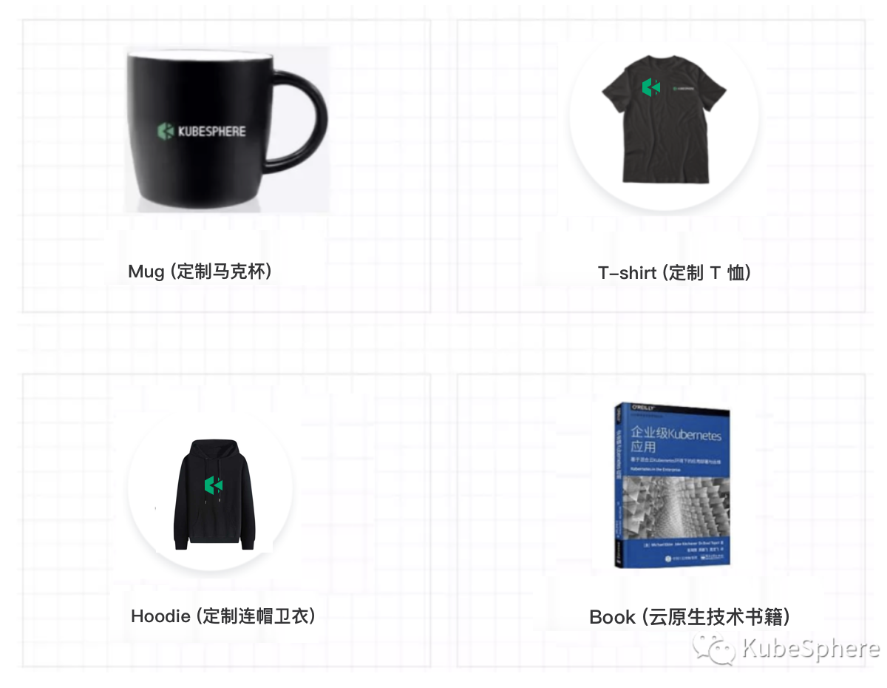

# Open Source Technical Writing Award Program

Open Source Technical Writing Award Program is designed to reward people who write and contribute to our to community with high quality technical blogs. This program is open to anyone, We welcome anyone to contribute and join this plan to compete for the award. This program is organized by each SIG and will be reviewed in each season, and we will reward outstanding individuals and SIGs from the contribution ranking. 

Are you ready to obtain the prizes?

## Technical Content We Prefer

Whether you are a user, a developer, or a contributor, you can find the direction that interests you from the following prompts. 

- A complete step-by-step tutorial using KubeSphere, leveraging several open source CNCF projects into the demonstration
- Deep dive into a single component or a feature of KubeSphere, including its in-depth interpretation regarding the principle or architecture
- Best practice of running KubeSphere in production
- Case study of running KubeSphere in your organization or company

## Prizes for Outstanding Contributors 

<table>
  <tr>
      <td width="50%" align="center"><b>Keyboard: Keychron K2</b></td>
      <td width="50%" align="center"><b>Huawei Watch: Band4 Pro</b></td>
  </tr>
  <tr>
     <td></td>
     <td></td>
  </tr>
  <tr>
      <td width="50%" align="center"><b>Sound: JBL Go 2</b></td>
      <td width="50%" align="center"><b>Book, Clothing, Mug</b></td>
  </tr>
  <tr>
     <td></td>
     <td></td>
  </tr>
</table>

## How to Contribute

Read the README from the repository of [KubeSphere website](https://github.com/kubesphere/website), submit a Pull Request with your blogs to the related folders. For example, the English blogs are supposed to be submitted to [website/content/en/blogs/
](https://github.com/kubesphere/website/tree/master/content/en/blogs), and Chinese blogs are saved in [website/content/zh/blogs/](https://github.com/kubesphere/website/tree/master/content/zh/blogs).

If your content is great, we will submit and contribute it to [CNCF Blog](https://www.cncf.io/blog/), [KubeWeekly](https://kubeweekly.io/), [Kubernetes Blog](https://kubernetes.io/blog/), etc. 

## Technical Content Contribution List for Q4, 2020

The SIGs, blogs, and contributors at present are listed in the table below. Both English and Chinese content are acceptable, but English is preferred since it is easier to publish to the global community. Please mark the language after the blog title.

| Group |  Slack Channel | Blog (En/Zh) | Contributor (GitHub ID) |
|-------|-------------|--------------|--------------------|
| [Apps](./sig-apps/) | [#sig-apps](https://kubesphere.slack.com/messages/sig-apps) |  |  |
| [App Store](./sig-appstore) |  [#sig-appstore](https://kubesphere.slack.com/messages/sig-appstore) |   |  |
| [Architecture](./sig-architecture) | [#sig-architecture](https://kubesphere.slack.com/messages/sig-architecture) |   |  |
| [Cloud Providers](./sig-cloud-providers) | [#sig-cloud-providers](https://kubesphere.slack.com/messages/sig-cloud-providers) |  |
| [Console](./sig-console) | [#sig-console](https://kubesphere.slack.com/messages/sig-console) | |  |
| [DevOps](./sig-devops) | [#sig-devops](https://kubesphere.slack.com/messages/sig-devops) | |
| [Docs](./sig-docs) | [#sig-docs](https://kubesphere.slack.com/messages/sig-docs) | | |
| [Edge Computing](./sig-edge) | [#sig-edge](https://kubesphere.slack.com/messages/sig-edge) | |  |
| [Installation](./sig-installation) | [#sig-installation](https://kubesphere.slack.com/messages/sig-installation) | |  |
| [Microservice management](./sig-microservice) | [#sig-microservice](https://kubesphere.slack.com/messages/sig-microservice) | |  |
| [Multi-cluster](./sig-multicluster) | [#sig-multicluster](https://kubesphere.slack.com/messages/sig-multicluster) | | |
| [Multi-tenancy](./sig-multitenancy) | [#sig-multitenancy](https://kubesphere.slack.com/messages/sig-multitenancy) | |  |
| [Network](./sig-network) | [#sig-network](https://kubesphere.slack.com/messages/sig-network) | |  |
| [Observability](sig-observability) | [#sig-observability](https://kubesphere.slack.com/messages/sig-observability) | |  |
| [Release](./sig-release) | [#sig-release](https://kubesphere.slack.com/messages/sig-release) |  |
| [Storage](./sig-storage) | [#sig-storage](https://kubesphere.slack.com/messages/sig-storage) |  |
| [Testing](./sig-testing) | [#sig-testing](https://kubesphere.slack.com/messages/sig-testing) | |  |
| [Virtualization](./sig-virtualization) | [#sig-virtualization](https://kubesphere.slack.com/messages/sig-virtualization) | |  |

